# Meow - HackTheBox (Easy)

**Meow** - это одна из простых машин на платформе HTB, которая находится в разделе *Starting Point*. 

Машина представляет собой классический пример работы с уязвимостями, такими как **неправильные настройки безопасности и незащищённые сервисы**. В процессе её решения мы столкнёмся с открытыми портами и уязвимыми сервисами, которые можно использовать для получения доступа. Основная уязвимость заключается в том, что на целевой машине работает **Telnet** с пустым паролем, что позволяет злоумышленнику получить доступ к системе без необходимости аутентификации.

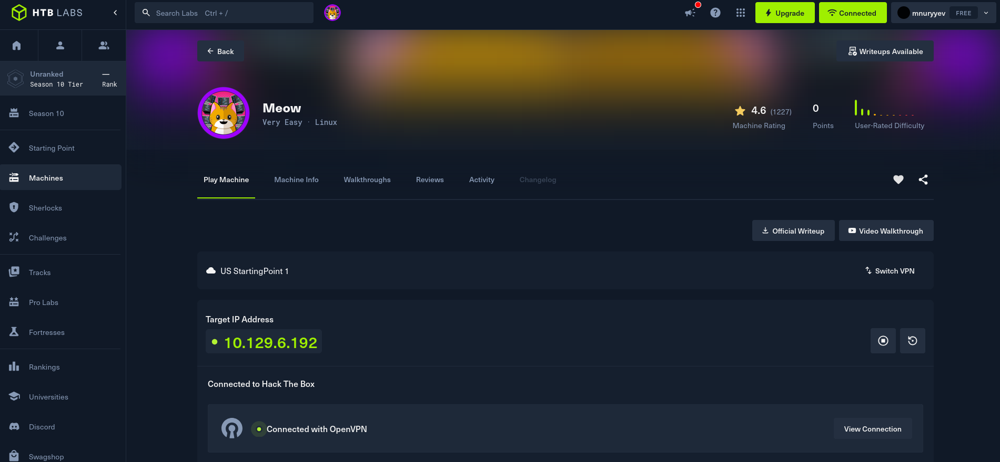

* * *

## Task 1: Что означает аббревиатура VM?

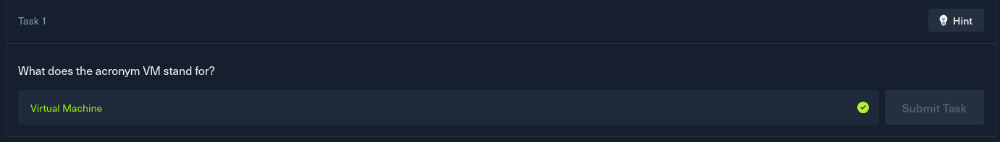

VM расшифровывается как **Virtual Machine** (виртуальная машина).

В контексте платформы HTB, **VM** - это виртуальная среда, в которой выполняются все задачи. Виртуальная машина имитирует настоящую операционную систему, и она используется для того, чтобы безопасно тестировать уязвимости и проводить различные атаки, не рискуя повредить свою основную систему.

## Task 2: Какой инструмент мы используем для взаимодействия с операционной системой через командную строку, чтобы выполнять команды, например, для подключения к VPN? Этот инструмент также называют консолью или оболочкой.

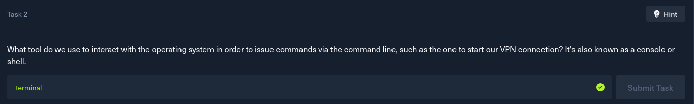

Для взаимодействия с операционной системой через командную строку используется терминал (или консоль). Это инструмент, который позволяет вводить команды для выполнения различных задач, таких как подключение к VPN, использование инструментов для сканирования и т.д.

## Task 3: Какой сервис мы используем для подключения к VPN в лаборатории HTB?

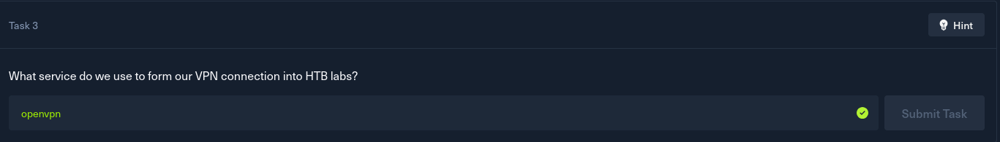

Для подключения к VPN в лаборатории HTB используется сервис OpenVPN. Это популярный инструмент с открытым исходным кодом, который позволяет создать безопасное зашифрованное соединение между нашим устройством и серверами HTB.

## Task 4: Какой инструмент мы используем для тестирования подключения к целевой машине с помощью ICMP-запроса?

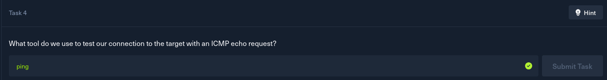

Для тестирования подключения к целевой машине мы используем команду **ping**. Этот инструмент отправляет *ICMP echo request* (запрос эхо) на целевой IP-адрес и ждёт ответа. Если машина доступна, она ответит на запрос, и мы сможем подтвердить, что она находится в сети и с ней можно работать. Команда ping - это простой и эффективный способ проверить доступность удалённой машины.

## Task 5: Какой инструмент является самым популярным для поиска открытых портов на целевой машине?

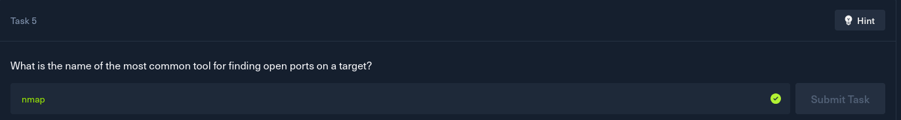

Для поиска открытых портов на целевой машине используется инструмент **Nmap**. Это мощный сканер сетевых портов, который позволяет обнаруживать открытые порты, а также определять сервисы, работающие на этих портах. Nmap является одним из самых популярных инструментов в мире безопасности, так как он предоставляет подробную информацию о целевой машине, что позволяет исследовать уязвимости и планировать дальнейшие шаги.

## Task 6: Какой сервис мы идентифицируем на порту 23/tcp во время сканирования? 

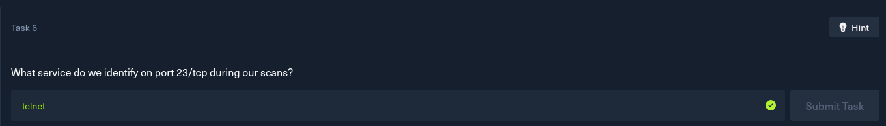

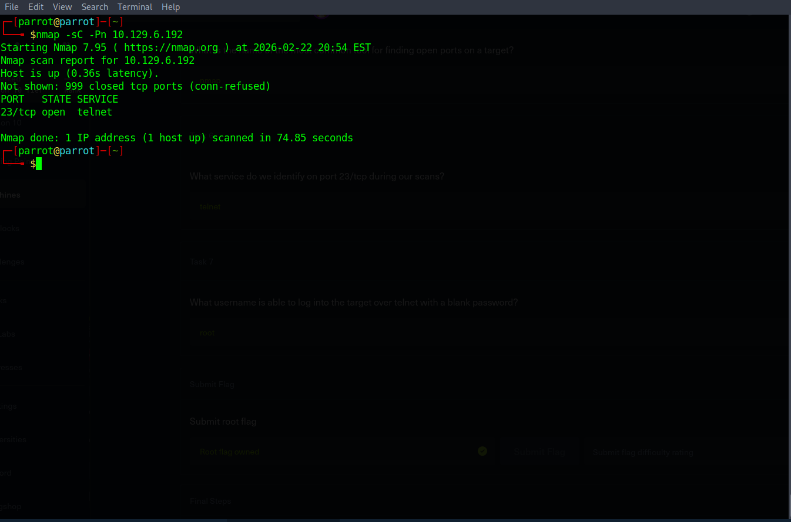

При сканировании порта *23/tcp* на целевой машине мы обнаруживаем сервис **Telnet**. Telnet это старый протокол для удалённого доступа, который используется для подключения к машинам и управления ими через командную строку. Однако, этот протокол небезопасен, так как передаёт данные, включая пароли, в открытом виде. Из-за этого Telnet часто заменяют более безопасными протоколами, такими как SSH, но он всё ещё может встречаться на старых системах.

## Task 7: Какой логин позволяет войти на целевую машину через Telnet с пустым паролем?

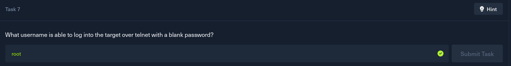

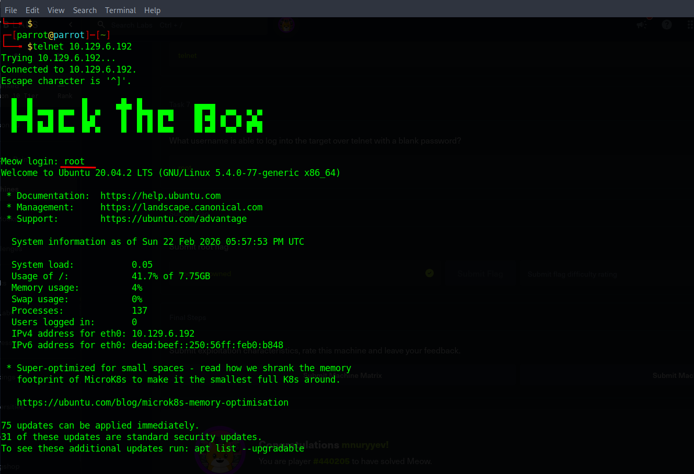

Для подключения к целевой машине через **Telnet** с пустым паролем мы можем использовать пользователя **root**. Это уязвимость, так как доступ к машине можно получить без пароля, просто указав логин root. Такая ошибка в настройках безопасности позволяет злоумышленникам легко получить доступ к системе с правами суперпользователя, что представляет собой серьёзную угрозу.

## Получение флага

После того как мы подключились к целевой машине через **Telnet** с пользователем **root** и пустым паролем, выполнили команду *ls* для просмотра содержимого текущего каталога. И тут видим файл *flag.txt*, который и содержит наш флаг.

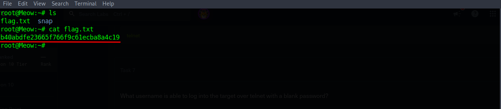

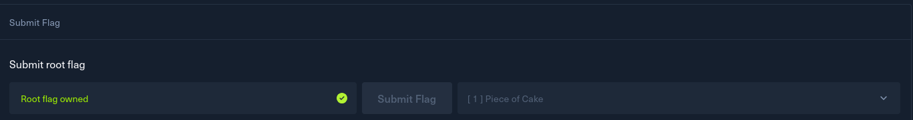

