# Redeemer - HackTheBox (Easy)

**Redeemer** - это простая машина на платформе HTB в разделе *Starting Point*.

Машина демонстрирует типичную проблему безопасности, то есть неправильно настроенный сервис **Redis**, который доступен по сети без аутентификации. В процессе решения мы обнаружим открытый порт, подключимся к базе данных и получим флаг напрямую из хранилища.

Основная уязвимость заключается в том, что **Redis** запущен без пароля и доступен извне, что позволяет любому подключиться и прочитать данные.

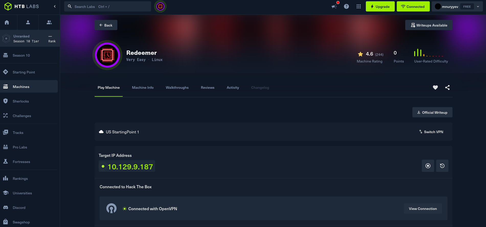

---

## Task 1: Какой TCP порт открыт на целевой машине?

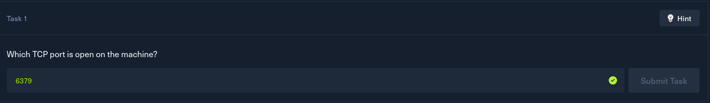

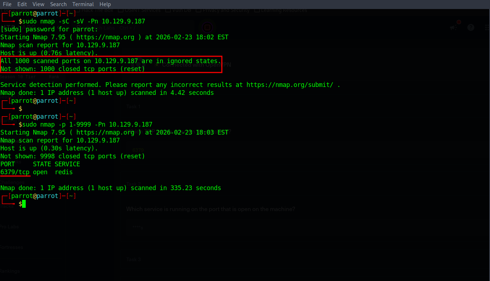

Для начала просканируем целевую машину, чтобы определить открытые порты.

Сначала запустили стандартное сканирование. Однако сканирование не показало ни одного открытого порта. Nmap по умолчанию проверяет только топ‑1000 наиболее популярных портов, и все они оказались закрыты или отфильтрованы.

Так как в задании указан порт из четырёх цифр, логично предположить, что сервис может работать на нестандартном порту за пределами топ‑1000. Поэтому просканируем диапазон портов от 1 до 9999.

И тут обнаруживаем открытый порт **6379**, и на нём работает сервис *Redis*.

Redis - это in‑memory база данных типа ключ → значение. Обычно её используют для кэширования, хранения сессий и ускорения работы приложений. В нормальной ситуации **Redis** не должен быть доступен из внешней сети без аутентификации, так как через него можно получить доступ к данным.

В нашем случае именно Redis является точкой входа в систему.

---

## Task 2: Какой сервис работает на открытом порту?

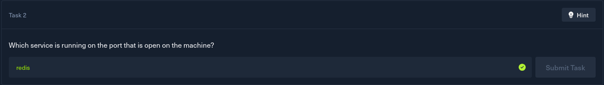

На открытом **6379** порту работает сервис *Redis*

---

## Task 3: Какой тип базы данных Redis? (i) In-memory Database, (ii) Traditional Database

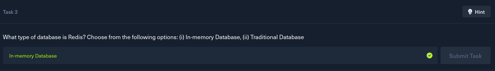

Redis является **In-memory Database**.

Это означает, что данные хранятся в оперативной памяти (RAM), а не на диске, что обеспечивает очень высокую скорость работы. Redis часто используется для кэширования данных, хранения сессий пользователей и очередей задач.

---

## Task 4: Какая утилита используется для взаимодействия с Redis через командную строку?

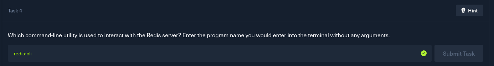

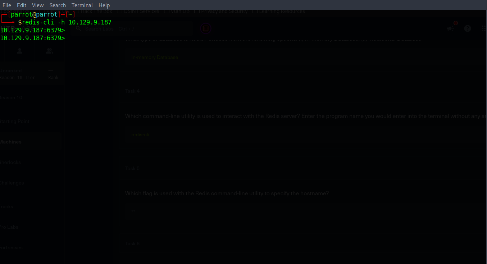

Для взаимодействия с Redis используется утилита **redis-cli**. Это официальный клиент командной строки для работы с Redis-сервером.

---

## Task 5: Какой флаг используется в redis-cli для указания хоста?

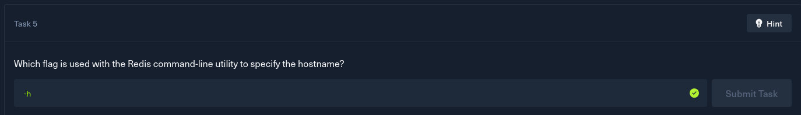

Чтобы подключиться к удалённому Redis-серверу, необходимо указать его IP-адрес.

Для этого используется флаг**-h**. Этот флаг указывает хост, к которому мы хотим подключиться.

---

## Task 6: Какая команда используется для получения информации и статистики о Redis?

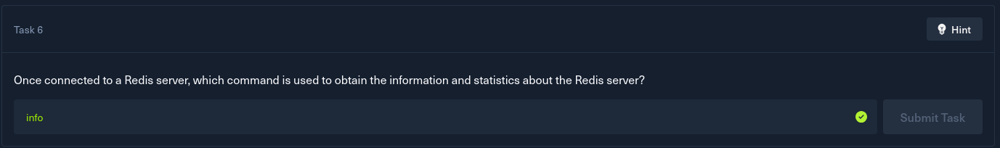

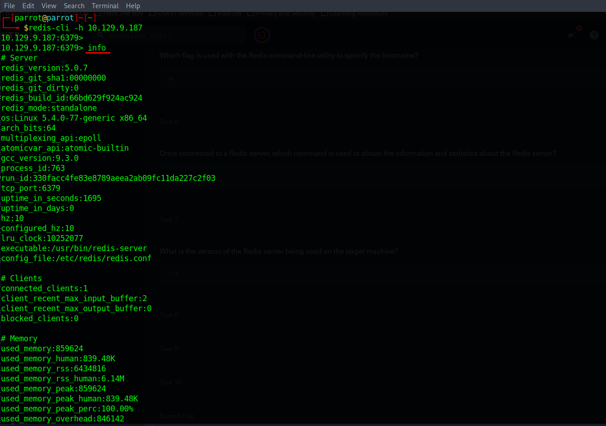

После подключения к серверу Redis можно получить информацию о системе с помощью команды **info**. 

Команда info показывает:

* версию Redis
* используемую память
* количество подключений
* информацию о базах данных

---

## Task 7: Какая версия Redis установлена на целевой машине?

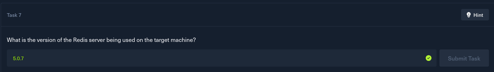

Версия Redis на целевой машине: **5.0.7**

---

## Task 8: Какая команда используется для выбора нужной базы данных в Redis?

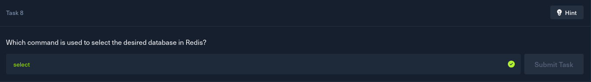

Redis поддерживает несколько логических баз данных (по умолчанию от 0 до 15).

Для выбора базы используется команда **SELECT**.

---

## Task 9: Сколько ключей находится в базе с индексом 0?

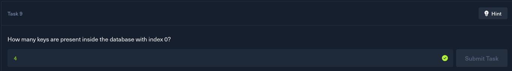

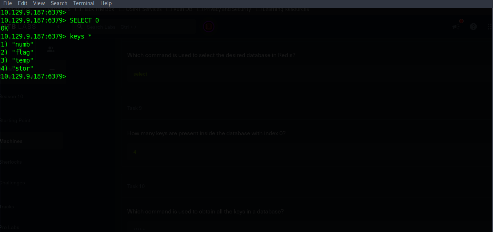

В выводе команды *info* в разделе Keyspace было указано *db0:keys=4*

Это означает, что в базе данных с индексом 0 находится **4 ключа**. 

---

## Task 10: Какая команда используется для получения всех ключей из базы?

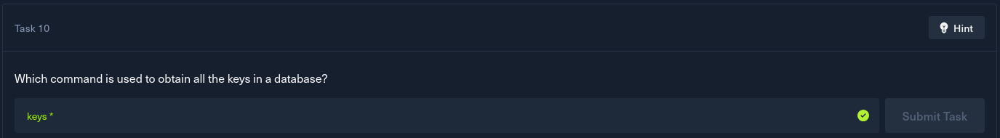

Чтобы получить список всех ключей в базе данных, используется команда KEYS *. Команда KEYS * выводит все сохранённые ключи.

После выполнения мы видим:

* numb
* flag
* temp
* stor

---

# Получение флага

Мы видим среди ключей ключ с названием **flag**. Чтобы узнать его значение, используем команду *GET flag*. Команда *GET* позволяет получить значение любого ключа типа string в Redis.

После выполнения команды Redis возвращает содержимое ключа flag, и это и есть флаг машины Redeemer.

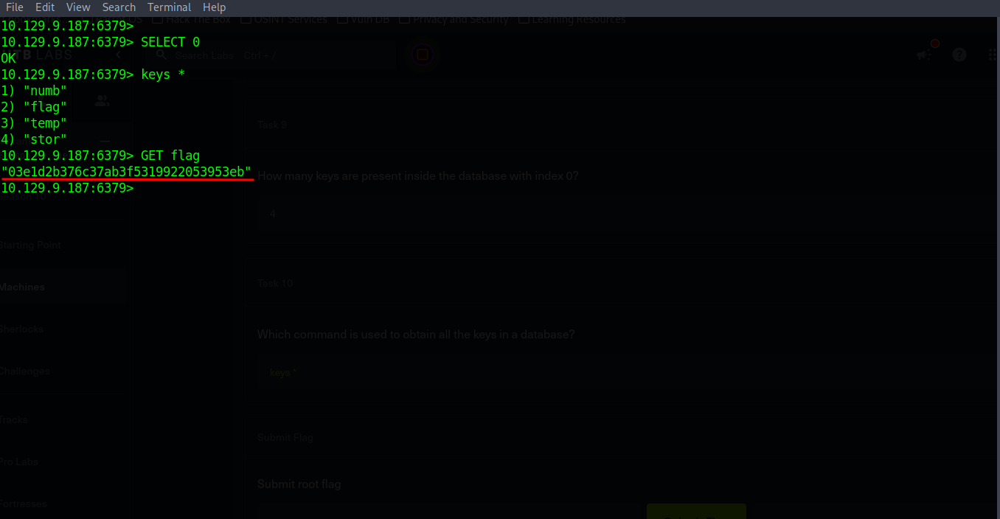

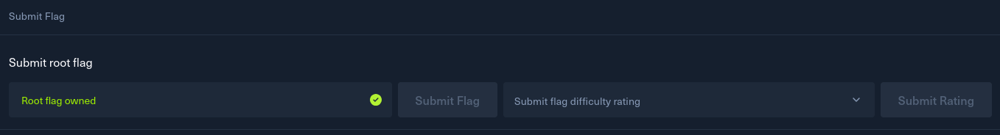

