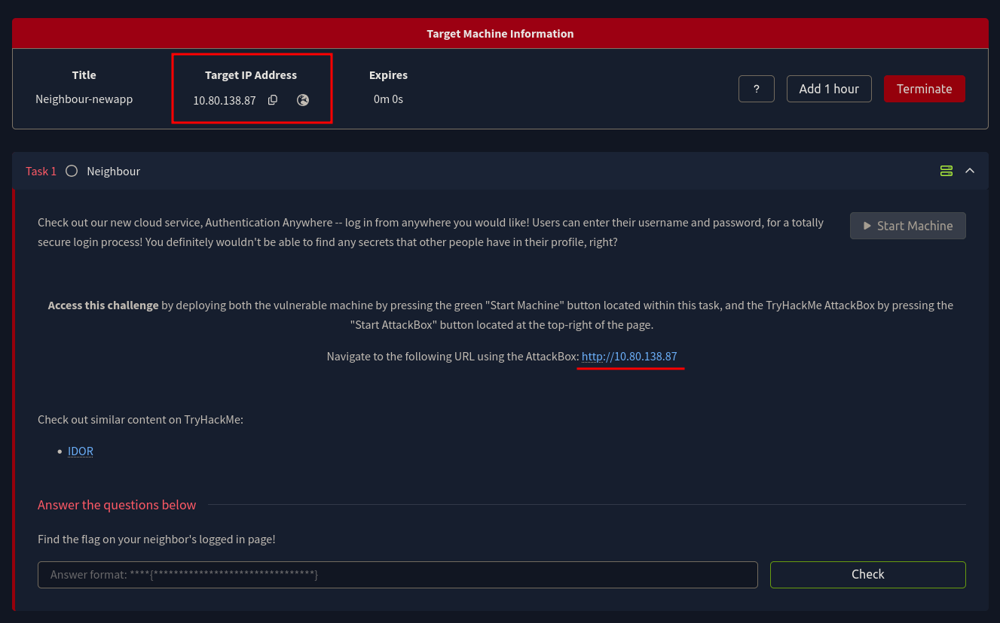
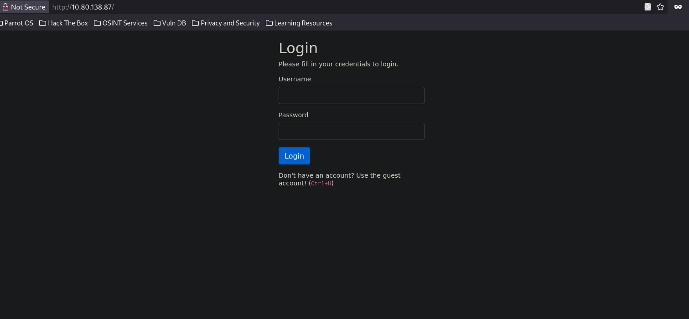
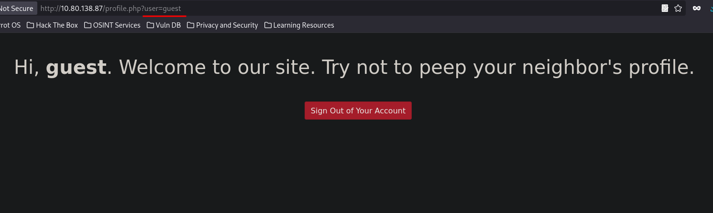
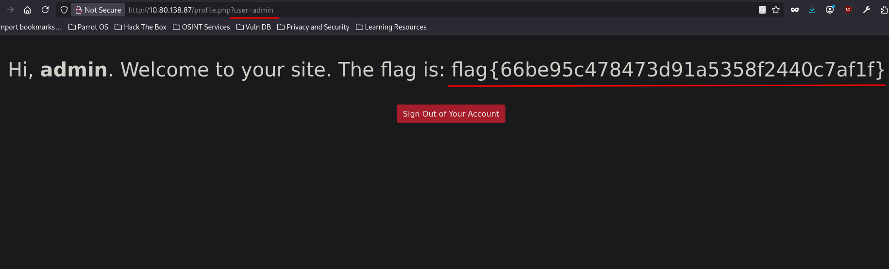
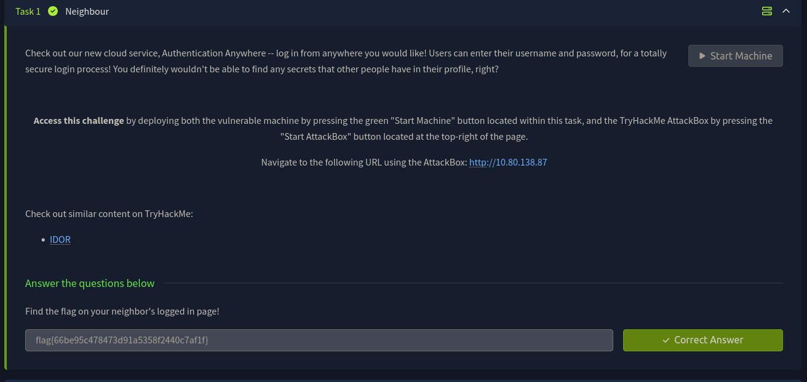

**Insecure Direct Object Reference (IDOR)** - это классическая уязвимость категории **Broken Access Control (A01 в OWASP Top 10 2021)**, при которой приложение позволяет пользователю напрямую обращаться к внутренним объектам системы (профили, файлы, записи в базе данных) путём изменения параметров запроса, при этом сервер не выполняет проверку прав доступа.

Фактически приложение доверяет данным, полученным от клиента, и не контролирует, имеет ли пользователь право запрашивать конкретный объект. В результате злоумышленник может изменить идентификатор в запросе и получить доступ к чужим данным.

В рамках данной работы мы рассмотрим уязвимость **IDOR** на примере простой веб-машины **Neighbour** с платформы TryHackMe. Развернём лабораторную среду и последовательно пройдём путь от этапа разведки до получения флага администратора.

## Фаза 1. Разведка и доступ к приложению

Машина **Neighbour** это веб-приложение под названием "Authentication Anywhere", которое якобы позволяет безопасно логиниться откуда угодно.

Приложение используется для проверки контроля доступа. Необходимо определить, можно ли получить доступ к чужим профилям и данным через изменение параметров запросов, что соответствует уязвимости типа **IDOR**.

## Шаг 1. Доступ к целевому IP

После запуска виртуальной машины получаем целевой IP‑адрес, ***10.10.138.87***.

Открываем браузер и переходим по адресу: **http://10.10.138.87**

Нас встречает страница логина с двумя полями: Username и Password. Под формой мелким шрифтом подсказка:
Don't have an account? Use the guest account! (Ctrl+U)

