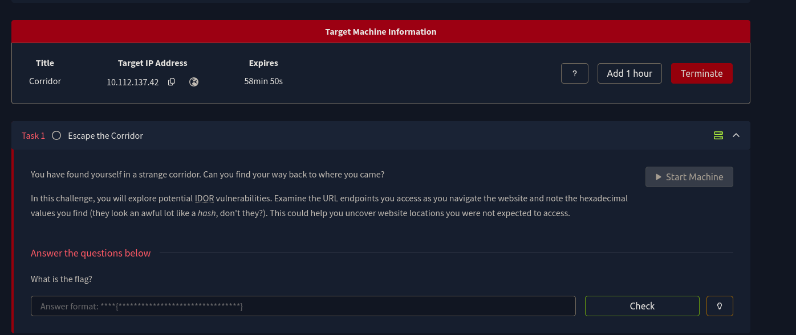
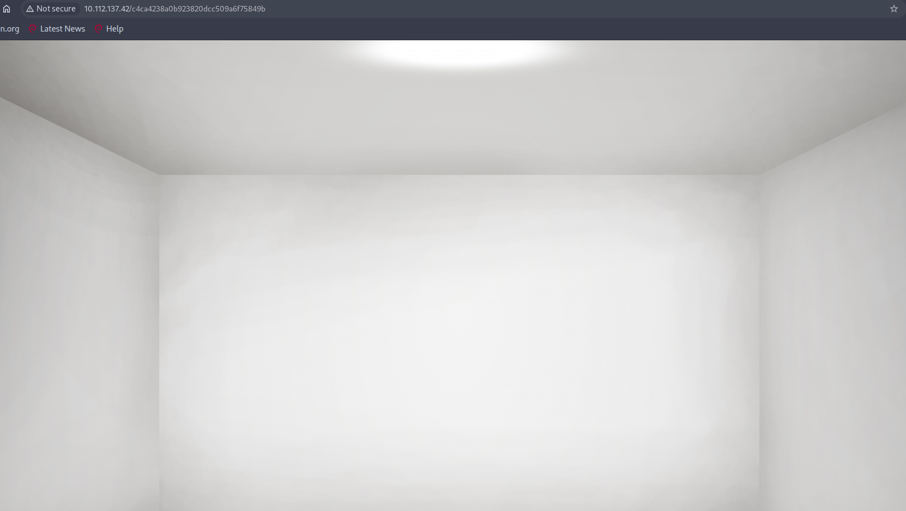
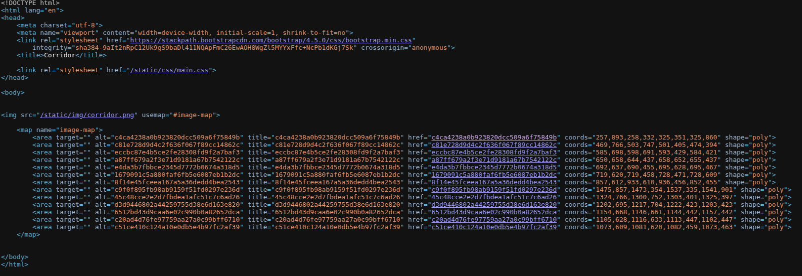
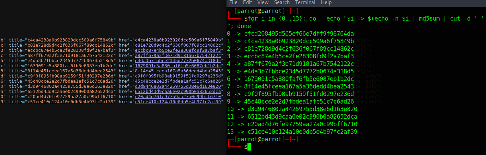
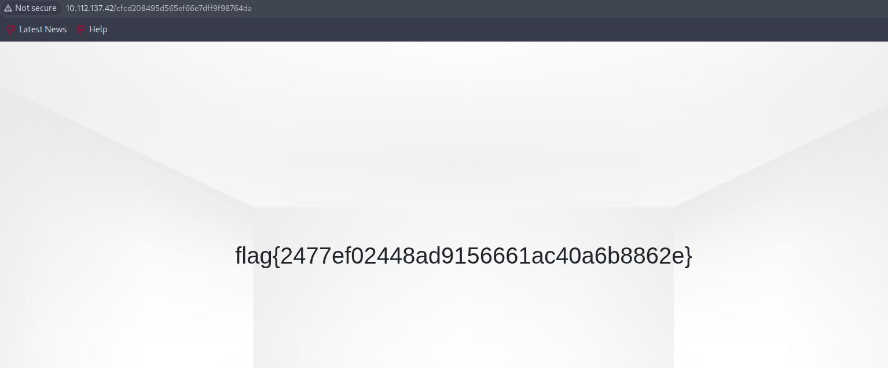
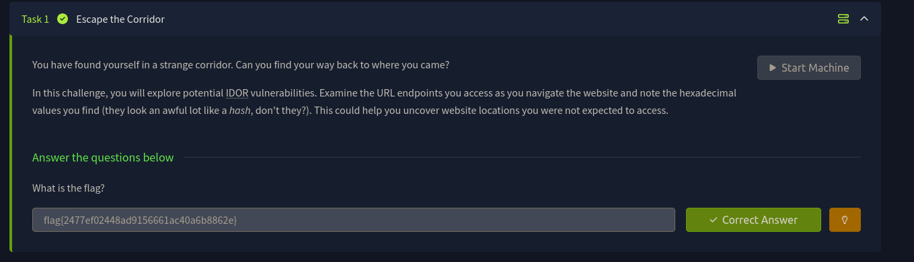

# Corridor - TryHackMe (easy)

**IDOR (Insecure Direct Object Reference)** относится к категории уязвимостей **Broken Access Control (A01 OWASP Top 10 2021)** и возникает в ситуациях, когда приложение предоставляет прямой доступ к внутренним объектам системы через параметры запроса, не выполняя проверку прав доступа пользователя.

В результате атакующий может изменять идентификаторы в URL и получать доступ к данным, которые ему не принадлежат.

В данной комнате рассматривается веб-приложение Corridor с платформы TryHackMe, в котором реализована уязвимость IDOR через использование предсказуемых идентификаторов объектов.

---

## Фаза 1. Первичное исследование приложения

После запуска виртуальной машины открывается веб-страница с изображением коридора, содержащего 13 дверей. Каждая дверь является интерактивным элементом и ведёт на отдельный ресурс.

### Шаг 1. Изучение структуры страницы

Первая комната:

При анализе исходного кода страницы (Ctrl+U) обнаруживается HTML-карта изображения (image map), в которой каждая дверь представлена ссылкой формата

Все значения представляют собой 32-символьные строки, характерные для MD5-хэшей, что указывает на использование хэшированных идентификаторов вместо обычных числовых ID.

### Шаг 2. Анализ механизма формирования ссылок

В ходе анализа видим, что каждый идентификатор соответствует результату MD5-хэширования чисел.

Приложение использует детерминированные хэши как идентификаторы объектов, что делает их предсказуемыми.

---

## Фаза 2. Эксплуатация уязвимости IDOR

### Шаг 3. Навигация по приложению

При переходе по каждой из дверей открывается отдельная страница. Однако визуально они не содержат явных отличий или полезной информации.

Это указывает на то, что сервер формирует ответ исключительно на основе переданного идентификатора без дополнительной логики доступа.

### Шаг 4. Проверка диапазона идентификаторов

Так как на странице отображается 13 дверей, изначально можно предположить, что используются значения в диапазоне 1–13. Каждая дверь соответствует MD5-хэшу от числового значения.

При проверке соответствия хэшей становится видно, что интерфейс отображает только часть возможных значений и не показывает полный диапазон идентификаторов, используемых на backend.

### Шаг 5. Обнаружение скрытого ресурса

При сопоставлении MD5-хэшей с числовыми значениями (0–13) выясняется, что в интерфейсе отсутствует отображение значения 0, однако сервер корректно обрабатывает его при прямом обращении.

Backend использует полный диапазон значений, включая скрытые, не представленные в HTML. При обращении к MD5-хэшу для 0 становится доступен скрытый ресурс с флагом.

Пробуем 0: cfcd208495d565ef66e7dff9f98764da

---

## Фаза 3. Суть уязвимости

Основная проблема заключается в том, что приложение:
- использует предсказуемые идентификаторы (MD5 от чисел);
- не ограничивает допустимые значения на уровне сервера;
- доверяет данным, поступающим из URL;
- не проверяет права доступа к объектам.

В результате любой пользователь может напрямую обращаться к внутренним ресурсам системы, что является классическим примером IDOR.
