# Basic Pentesting - TryHackMe (Easy)

## Введение

**Basic Pentesting** - классическая обучающая машина на TryHackMe, охватывающая полный цикл пентеста: разведку, перебор директорий, SMB-перечисление, брутфорс SSH и работу с зашифрованными ключами. Задача - получить доступ к машине через несколько последовательных шагов, каждый из которых опирается на результаты предыдущего.

Машина объединяет несколько тем: веб-разведку, анализ SMB, словарные атаки и работу с приватными SSH-ключами.

---

## Фаза 1. Разведка

### Шаг 1. Запуск машины

Запускаем целевую машину через интерфейс TryHackMe. После инициализации система выдаёт IP-адрес - **`10.113.167.81`**.

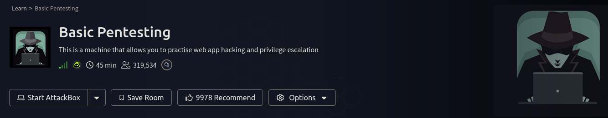

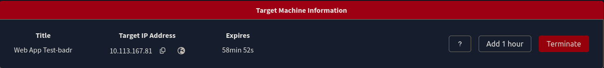

### Шаг 2. Сканирование портов - Nmap

Начинаем с полного сканирования: флаг `-sC` запускает стандартные скрипты, `-sV` определяет версии сервисов.

```bash
sudo nmap -sC -sV 10.113.167.81
```

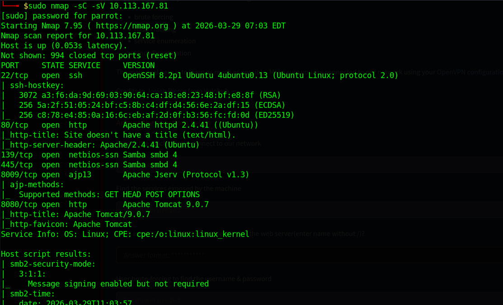

Результаты сканирования:

| Порт | Протокол | Сервис | Версия |
| --- | --- | --- | --- |
| 22 | TCP | SSH | OpenSSH 8.2p1 Ubuntu |
| 80 | TCP | HTTP | Apache 2.4.41 |
| 139 | TCP | SMB | Samba smbd 4 |
| 445 | TCP | SMB | Samba smbd 4 |
| 8009 | TCP | AJP | Apache Jserv Protocol v1.3 |
| 8080 | TCP | HTTP | Apache Tomcat 9.0.7 |

Интересная поверхность атаки: веб-сервер на 80, SMB-шары на 139/445 и Tomcat на 8080. Начинаем с веба.

### Шаг 3. Исследование веб-сервера (порт 80)

Открываем сайт по IP. Видим стандартную заглушку:

> **"Undergoing maintenance. Please check back later"**

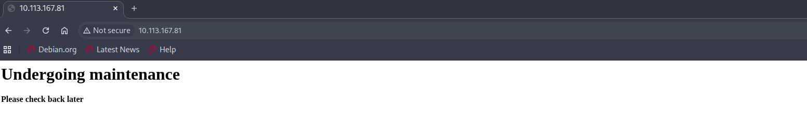

За заглушкой могут скрываться директории с разработческими артефактами. Запускаем перебор.

---

## Фаза 2. Веб-разведка

### Шаг 4. Поиск скрытых директорий - Gobuster

Используем Gobuster со стандартным словарём dirb:

```bash
gobuster dir -u http://10.113.167.81/ -w /usr/share/wordlists/dirb/common.txt
```

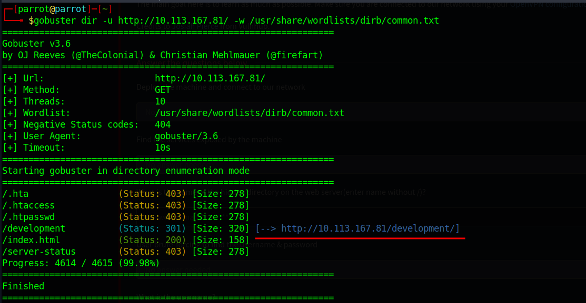

Gobuster находит директорию **`/development`** со статусом **301 Redirect**. Всё остальное либо 403 (запрещено), либо стандартный index.html.

### Шаг 5. Исследование /development

Открываем `http://10.113.167.81/development/` - директория с включённым листингом содержит два файла:

- **`dev.txt`** — заметки разработчиков
- **`j.txt`** — дополнительные заметки

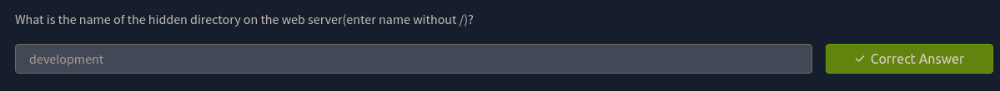

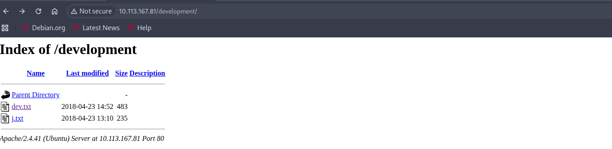

Файлы содержат подсказки об именах пользователей и методах доступа к системе. Это типичная ошибка - оставлять разработческие заметки в публично доступных директориях.

---

## Фаза 3. SMB-перечисление

### Шаг 6. Сбор пользователей через enum4linux

SMB на портах 139/445 - ценный источник информации о пользователях системы. Запускаем полное перечисление:

```bash
enum4linux -a 10.113.167.81
```

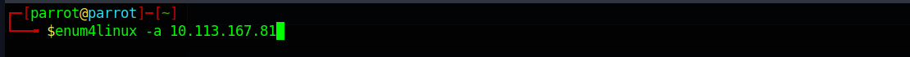

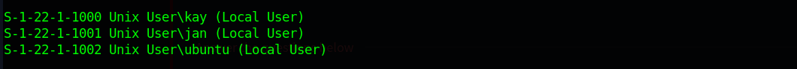

Вывод содержит список локальных пользователей в формате SID.

Есть три потенциальные цели. Начинаем с jan - судя по заметкам в dev.txt, этот аккаунт более вероятен для атаки.

---

## Фаза 4. Получение первоначального доступа

### Шаг 7. Брутфорс SSH - Hydra

Используем найденные имена пользователей и стандартный словарь для перебора паролей SSH:

```bash
hydra -l jan -P /usr/share/wordlists/rockyou.txt ssh://10.113.167.81
```

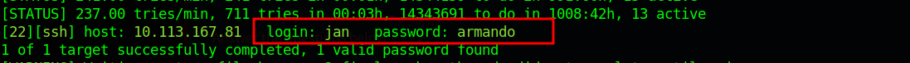

Hydra находит рабочие учётные данные.

### Шаг 8. Вход по SSH как jan

```bash
ssh jan@10.113.167.81
```

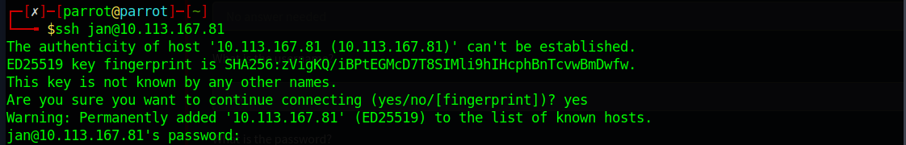

При первом подключении SSH запрашивает подтверждение fingerprint хоста - отвечаем `yes`. После ввода пароля успешно входим в систему.

### Шаг 9. Исследование системы

Смотрим содержимое домашней директории jan и переходим в /home:

```bash
ls -la
cat .lesshst   # Permission denied

ls /home
```

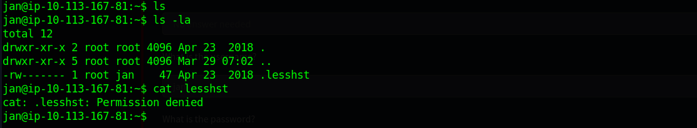

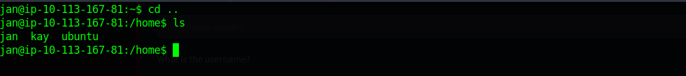

В `/home` видны три директории: `jan`, `kay`, `ubuntu`. Переходим к kay - именно там находится цель.

---

## Фаза 5. Горизонтальное перемещение

### Шаг 10. Исследование директории kay

```bash
cd /home/kay
ls
cat pass.bak   # Permission denied

ls -la
```

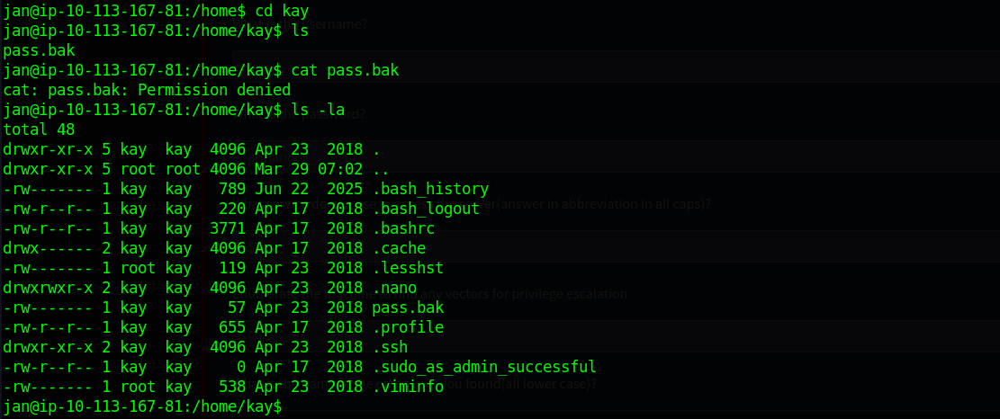

Видим файл `pass.bak` с правами `600` - читать может только kay. Но в директории `/home/kay/.ssh` есть приватный SSH-ключ.

### Шаг 11. SSH-ключи kay

```bash
cd /home/kay/.ssh
ls -la
cat authorized_keys
cat id_rsa
```


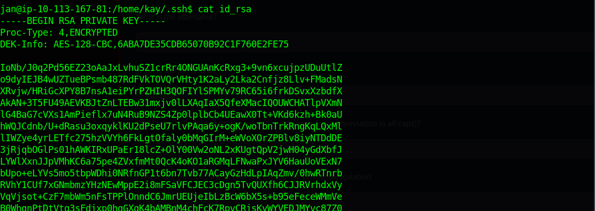

В `authorized_keys` - публичный ключ с показательным комментарием:

> **"I don't have to type a long password anymore!"**

В `id_rsa` - зашифрованный приватный ключ.

Ключ защищён passphrase. Копируем его на локальную машину.

---

## Фаза 6. Взлом SSH-ключа

### Шаг 12. Сохранение ключа локально

На локальной машине создаём файл с содержимым приватного ключа:

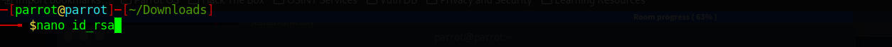

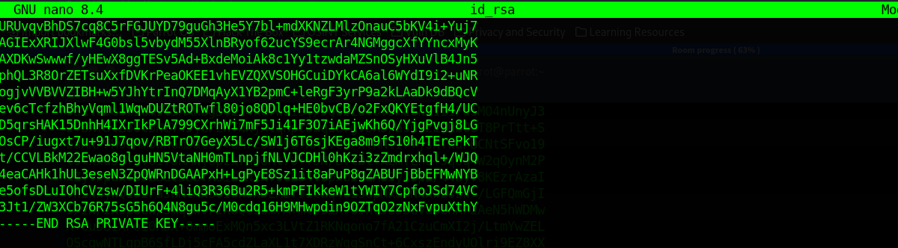

### Шаг 13. Установка правильных прав

SSH отказывается использовать ключ если его права слишком открыты. Исправляем:

```bash
chmod 600 id_rsa
```

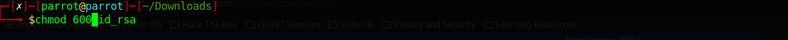

### Шаг 14. Проверка - SSH запрашивает passphrase

```bash
ssh -i id_rsa kay@10.113.167.81
```

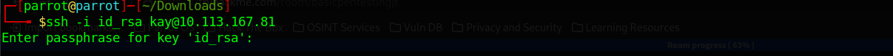

SSH принял ключ, но запрашивает passphrase. Переходим к взлому.

### Шаг 15. Конвертация ключа - ssh2john

Конвертируем приватный ключ в формат, понятный John the Ripper:

```bash
ssh2john id_rsa > key
```

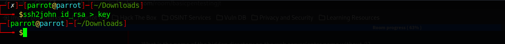

`ssh2john` извлекает зашифрованные параметры ключа и упаковывает их в формат хэша, который John умеет атаковать по словарю.

### Шаг 16. Взлом passphrase - John the Ripper

```bash
sudo john key --wordlist=/usr/share/wordlists/rockyou.txt
```

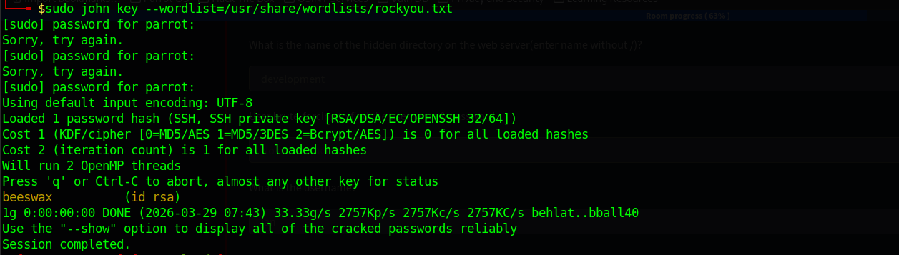

John находит passphrase практически мгновенно:

---

## Фаза 7. Получение доступа к аккаунту kay

### Шаг 17. Вход как kay

```bash
ssh -i id_rsa kay@10.113.167.81
```

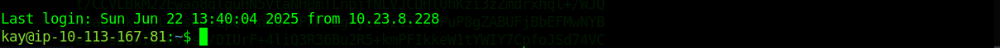

Успешный вход. Теперь мы действуем с правами пользователя kay.

### Шаг 18. Чтение pass.bak

```bash
ls
cat pass.bak
```

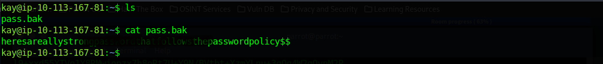

Файл `pass.bak` теперь доступен - kay является его владельцем. Содержимое раскрывает пароль, который ранее был недостижим для jan.

---

## Итоги

### Цепочка атаки

| Шаг | Инструмент | Действие | Результат |
| --- | --- | --- | --- |
| 1 | Nmap | Сканирование портов | 6 открытых сервисов |
| 2 | Gobuster | Перебор директорий | `/development` |
| 3 | Браузер | Анализ dev.txt, j.txt | Подсказки об именах пользователей |
| 4 | enum4linux | SMB-перечисление | Пользователи: kay, jan, ubuntu |
| 5 | Hydra | Брутфорс SSH | jan:armando |
| 6 | SSH (jan) | Исследование /home/kay/.ssh | Приватный ключ kay |
| 7 | ssh2john + John | Взлом passphrase | beeswax |
| 8 | SSH (kay) | Вход с ключом | Чтение pass.bak |

### Ключевые уязвимости машины

**Слабый пароль у jan** - `armando` присутствует в rockyou.txt и подбирается за секунды.

**Небезопасное хранение SSH-ключей** - приватный ключ kay находился в директории `/home/kay/.ssh` с правами, доступными для чтения другим пользователям. Jan смог его прочитать и скопировать.

**Слабая passphrase** - `beeswax` также есть в rockyou.txt. Зашифрованный ключ даёт лишь иллюзию защиты, если passphrase - словарное слово.

**Разработческие заметки в публичной директории** - файлы в `/development` были доступны без аутентификации и содержали внутреннюю информацию о системе.
