# Развертывание Wazuh SIEM для мониторинга и выявления сетевых атак в доменной среде Active Directory. Part-3. Установка и настройка Wazuh на Ubuntu Server

 мы установили все виртуальные машины, которые будут участвовать в нашем проекте. Теперь переходим к настройке главного компонента нашей лаборатории — системы мониторинга Wazuh. В этой части мы настроим сеть на Ubuntu Server и установим полный стек Wazuh: Manager, Indexer и Dashboard.

---

## Шаг 1. Проверка сетевых настроек

Первым делом после входа в систему мы проверяем текущие сетевые настройки. Открываем терминал и выполняем команду: **ip a**

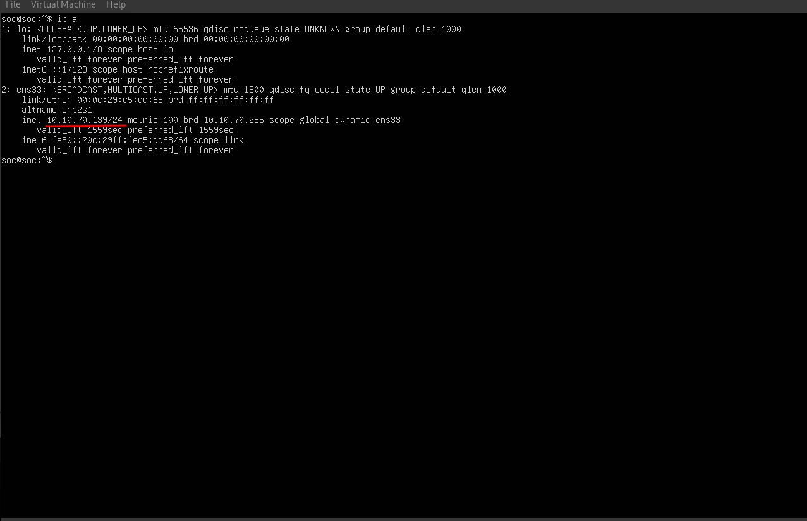

Мы видим, что интерфейс **ens33** получил динамический IP-адрес **10.10.70.139** по DHCP. Это нас не устраивает. Wazuh сервер должен иметь постоянный статический адрес, иначе агенты на Windows-машинах потеряют с ним связь после каждой перезагрузки.

---

## Шаг 2. Настройка статического IP

Для настройки сети в Ubuntu используется инструмент **Netplan**. Его конфигурационные файлы находятся в директории **/etc/netplan/**. Проверяем содержимое этой директории и открываем файл конфигурации в редакторе nano:

```
ls /etc/netplan/
sudo nano /etc/netplan/50-cloud-init.yaml
```

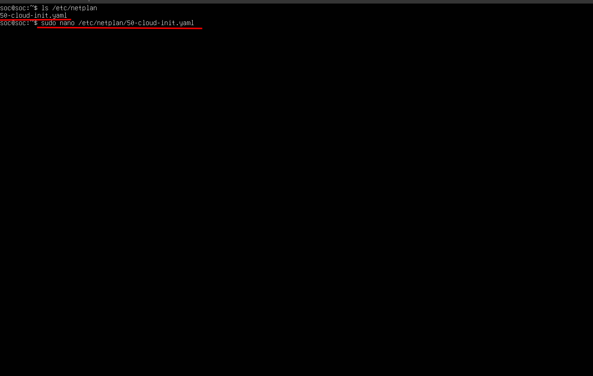

Нас встречает файл с настройками по умолчанию, где DHCP включён. Нам нужно изменить его так, чтобы интерфейс **ens33** получил статический адрес **10.10.70.30**, именно этот IP мы указали в нашей диаграмме для Wazuh сервера.

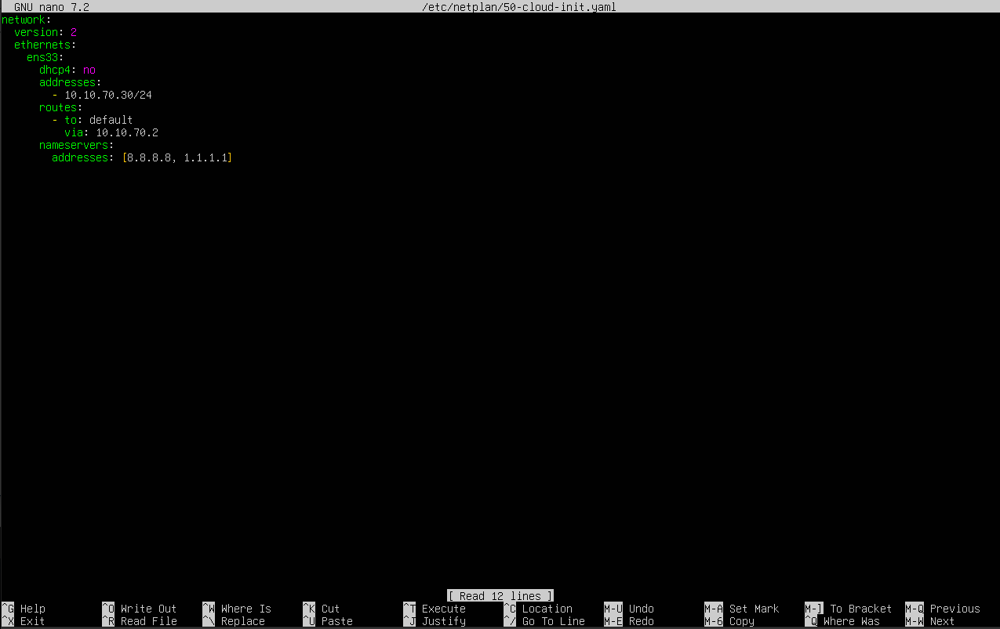

Редактируем файл следующим образом:

```
network:
  ethernets:
    ens33:
      dhcp4: no
      addresses: [10.10.70.30/24]
      nameservers:
        addresses: [8.8.8.8, 1.1.1.1]
      routes:
        - to: default
          via: 10.10.70.2
  version: 2
```

Разберём каждую строку.
- **dhcp4:** no отключает автоматическое получение адреса.
- **addresses** задаёт статический IP нашего сервера.
- **nameservers** указывает DNS-серверы, мы используем Google DNS и Cloudflare.
- **routes** прописывает маршрут по умолчанию через шлюз сети.

После сохранения применяем новую конфигурацию: ``` sudo netplan apply ```

---

## Шаг 3. Проверка сети после изменений

Проверяем, что статический IP применился корректно, и убеждаемся в наличии доступа в интернет: 

```
ip a
ping 8.8.8.8
```

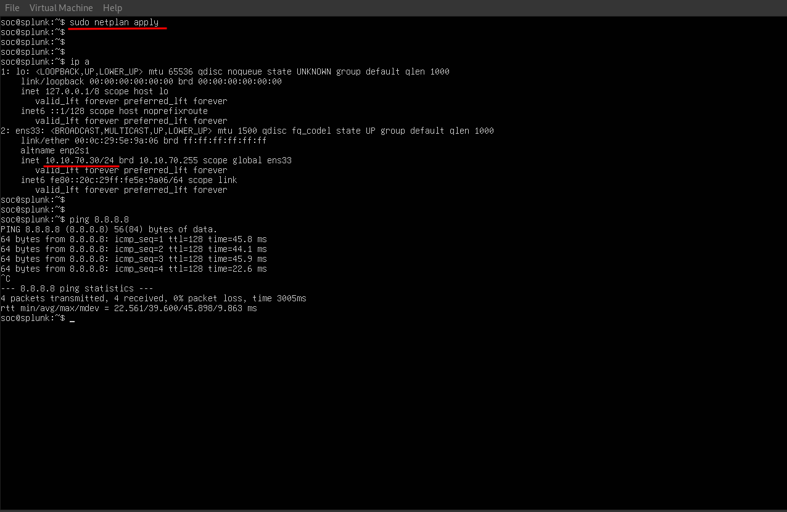

Мы видим, что интерфейс **ens33** теперь имеет адрес **10.10.70.30/24** - именно то, что нам нужно. Пинг до 8.8.8.8 проходит успешно, интернет-соединение работает. Переходим к следующему шагу.

---

## Шаг 4. Обновление системы

Перед установкой Wazuh обновим все пакеты системы до актуальных версий:
```
sudo apt-get update && sudo apt-get upgrade -y
```

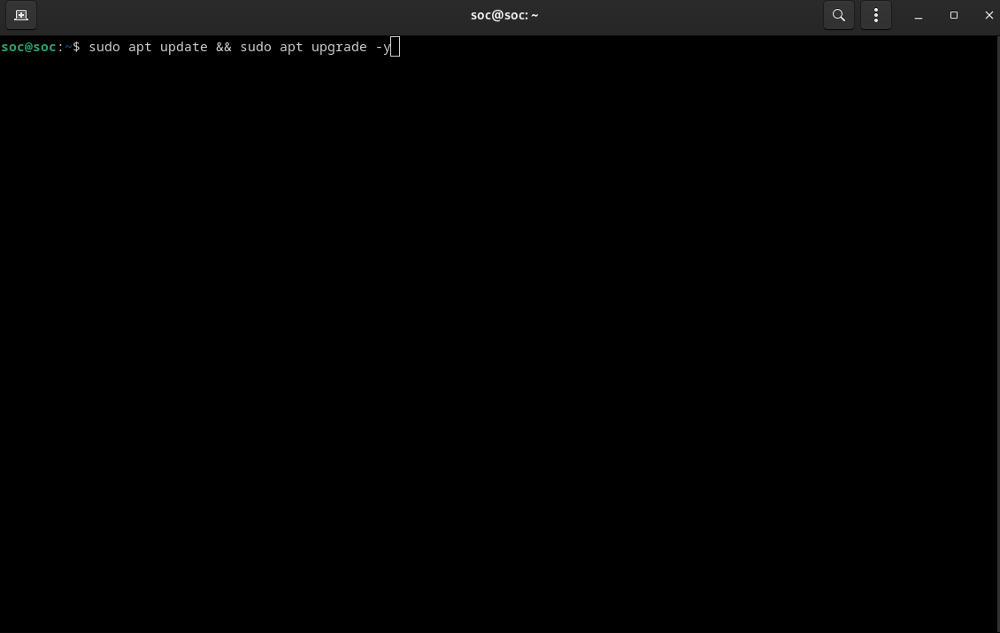


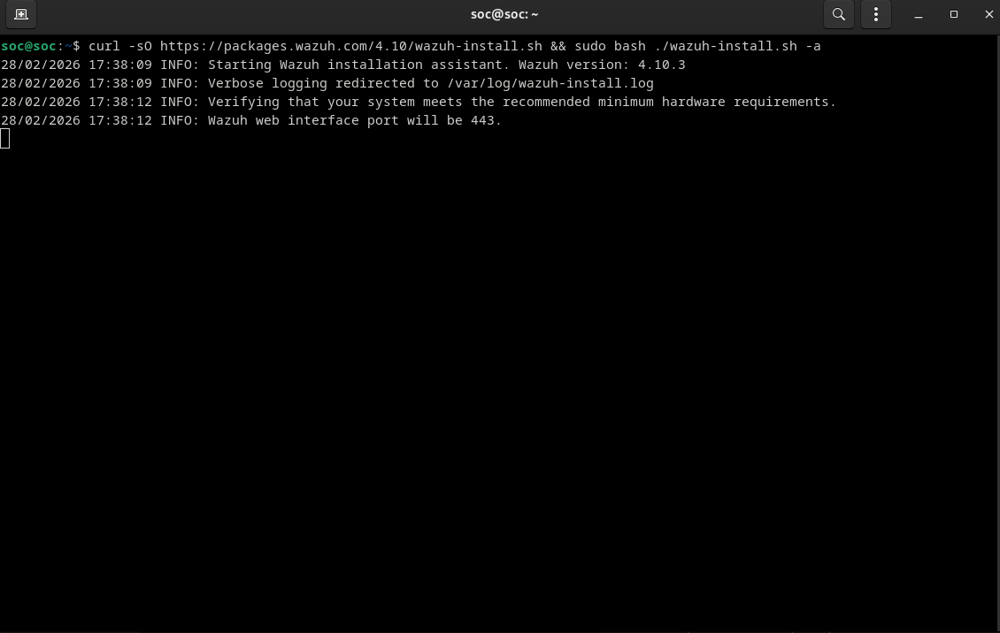


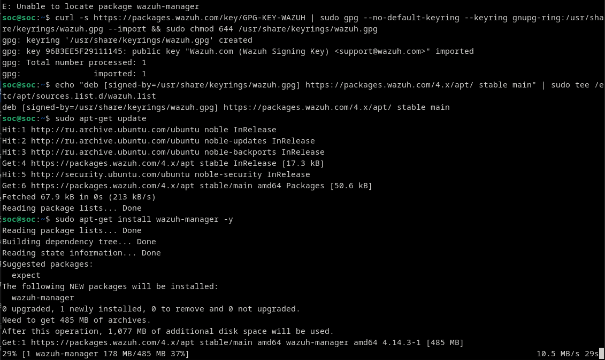


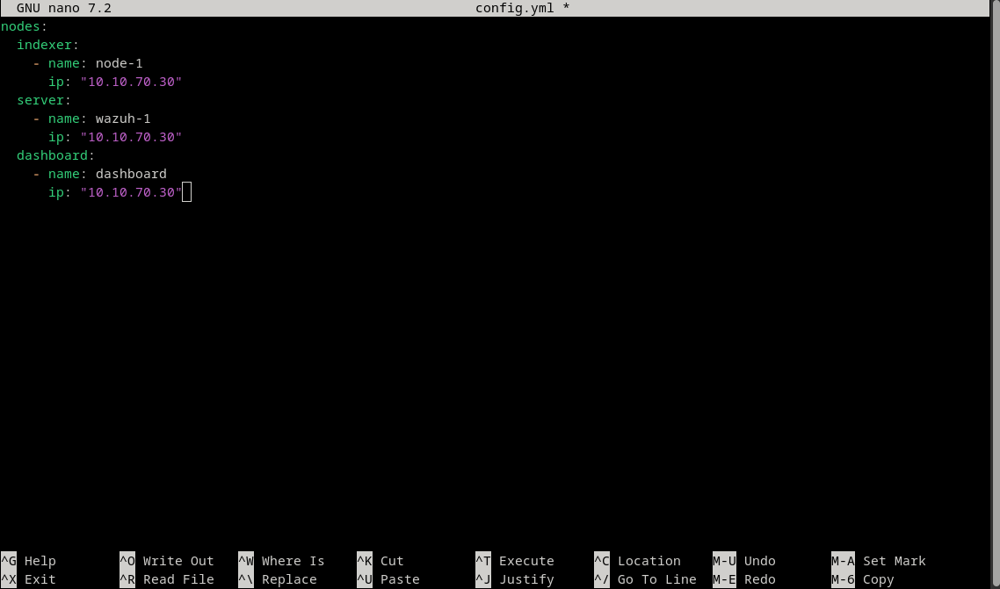


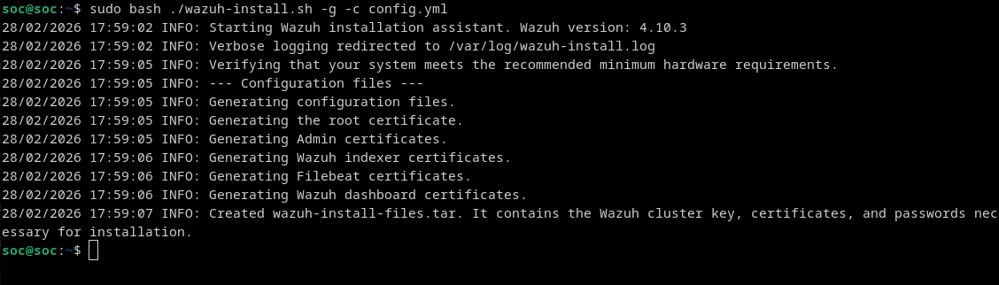


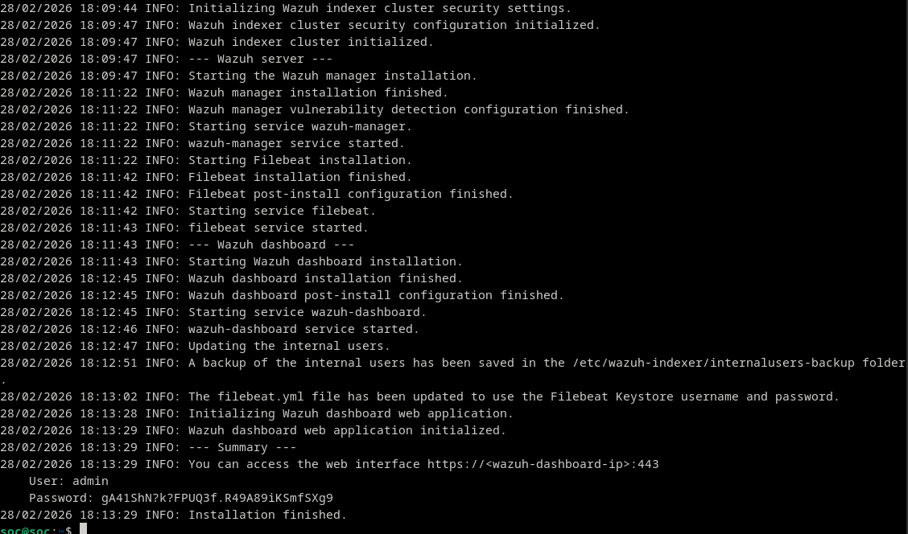


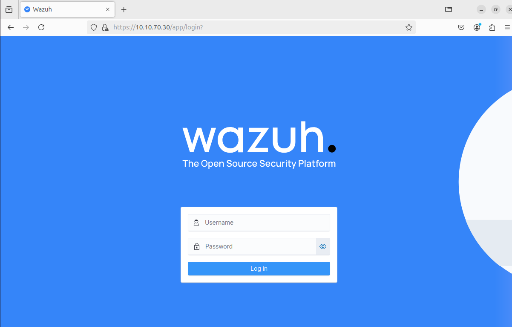


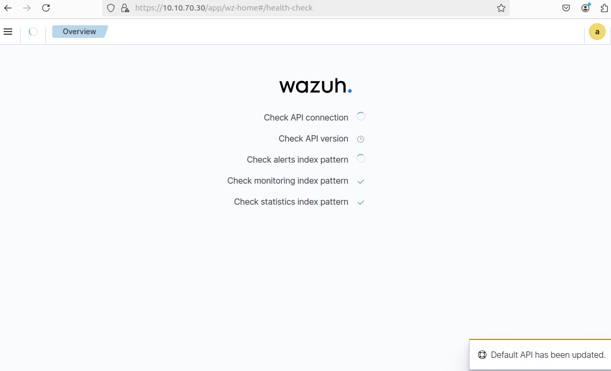


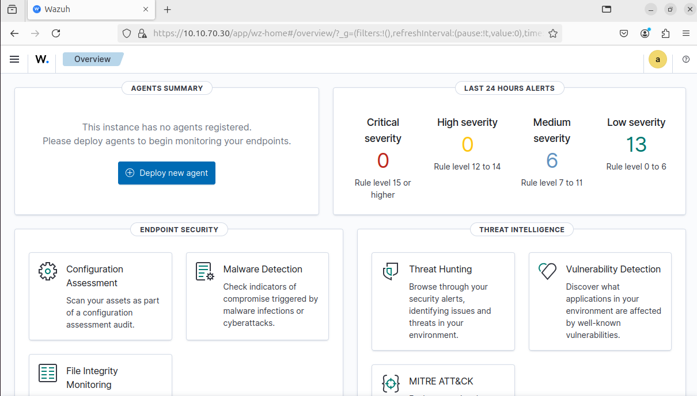
