# Развертывание Wazuh SIEM для мониторинга и выявления сетевых атак в доменной среде Active Directory. Part-6. Симуляция атаки и обнаружение в Wazuh

 были подготовкой к этому моменту. Мы построили инфраструктуру, настроили мониторинг, развернули домен. Теперь переходим к самому интересному — мы запустим реальную атаку с Kali Linux на нашу машину-жертву `target-PC` через протокол SMB с помощью Metasploit и посмотрим, как Wazuh её обнаруживает.

Сценарий будет следующим: атакующий проводит разведку сети, определяет версию операционной системы жертвы и проверяет её на наличие критических уязвимостей. Мы будем наблюдать за каждым шагом с двух сторон - со стороны атакующего в терминале Kali и со стороны защитника в Wazuh Dashboard.

---

## Фаза 1: Подготовка цели - включение RDP

### Шаг 1. Включение Remote Desktop на Windows 10

Прежде чем начинать атаку, включим RDP на машине-жертве - это сделает её более реалистичной целью, как это бывает в реальных корпоративных сетях, где RDP часто открыт для удалённого администрирования.

Открываем **Settings → System → Remote Desktop** и переводим переключатель в положение **On**.

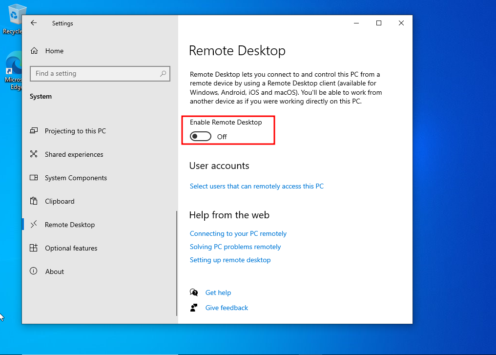

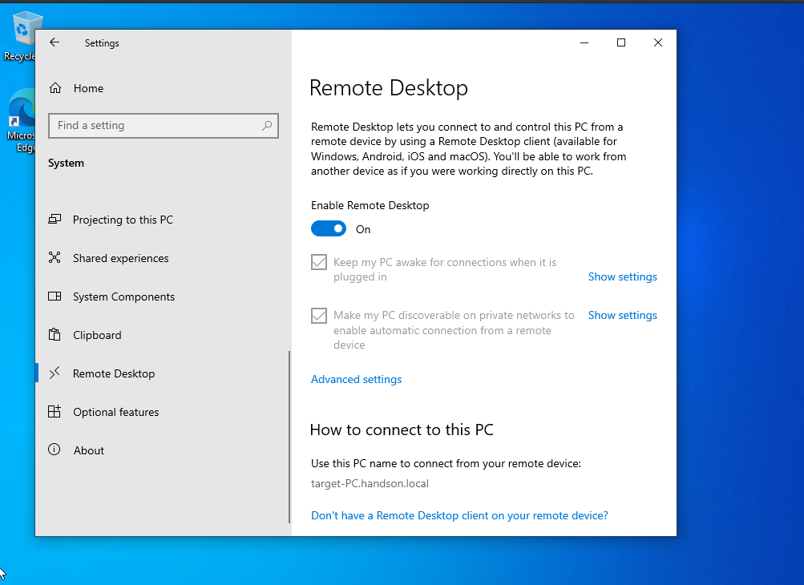

После включения мы видим полное доменное имя машины **`target-PC.handson.local`**.

---

## Фаза 2: Подготовка атакующей машины

### Шаг 2. Обновление Kali Linux

Переключаемся на машину атакующего  - **Kali**. Перед началом работы обновляем репозитории:

```bash
sudo apt update
```

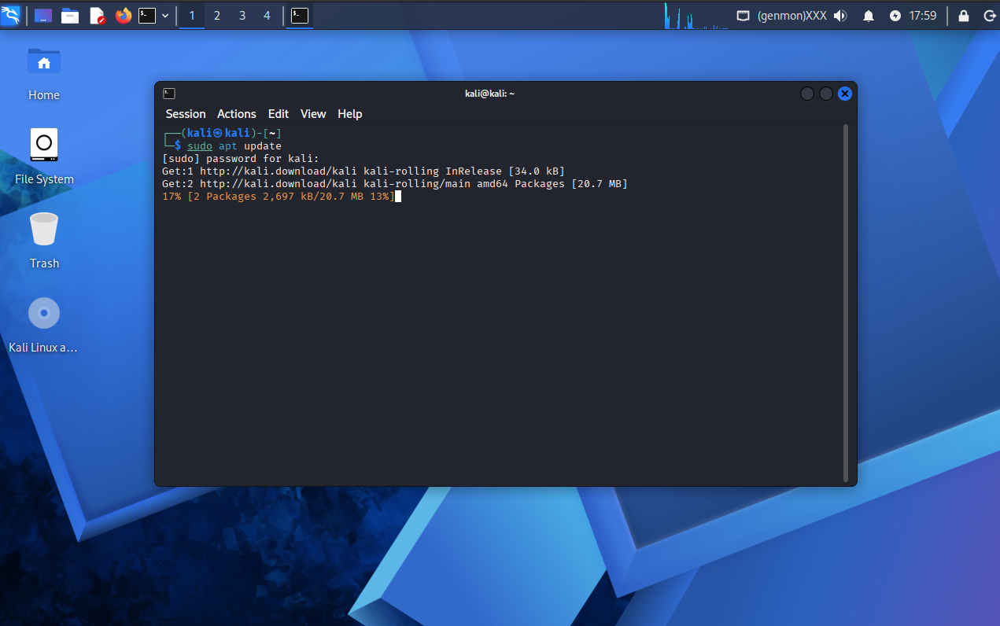

---

### Шаг 3. Настройка сети на Kali Linux

Проверяем сетевые настройки. Kali должен находиться в той же подсети, что и жертва - `10.10.70.0/24`. Если IP не был назначен автоматически, задаём его вручную (так как мы хотели изначально задать статический ip):

```bash
sudo ip addr add 10.10.70.60/24 dev eth0
sudo ip link set eth0 up
```

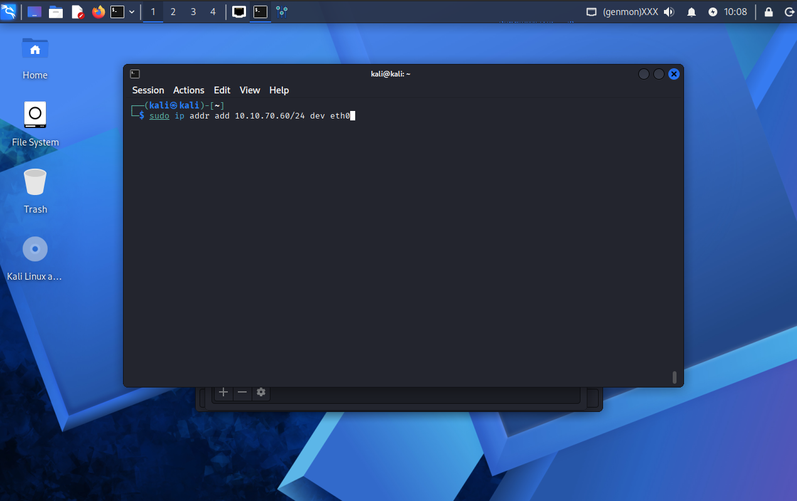

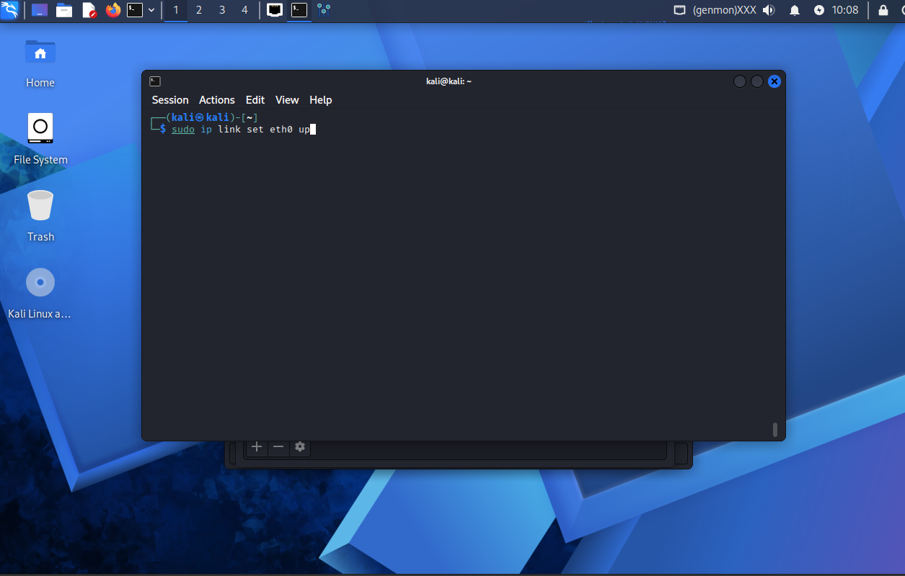

Проверяем результат:

```bash
ip a
```

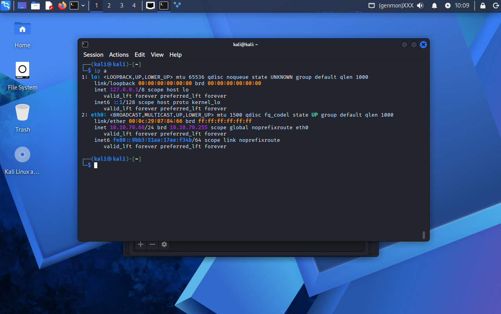

Интерфейс `eth0` поднят и имеет адрес `10.10.70.60/24` именно этот IP мы указывали в нашей диаграмме для атакующей машины.

---

### Шаг 4. Разведка — проверка доступности целей

Перед началом атаки проверяем доступность наших целей в сети:

```bash
ping 10.10.70.25
ping 10.10.70.134
```

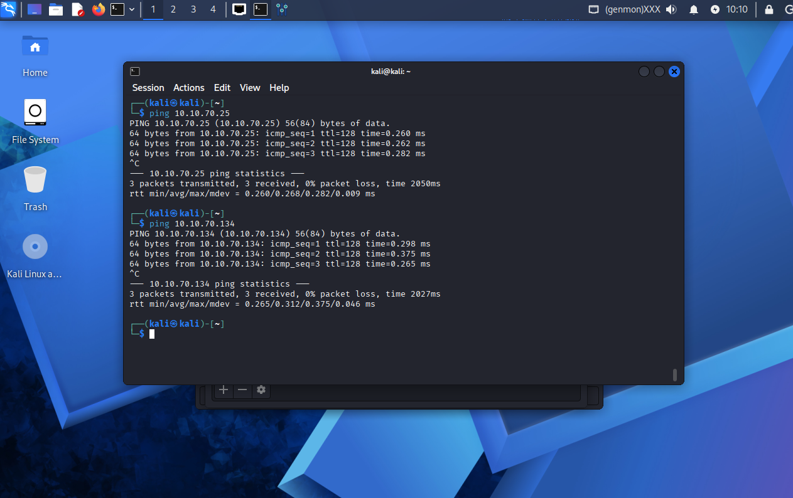

Оба пинга проходят успешно. Контроллер домена (`10.10.70.25`) и машина-жертва (`10.10.70.134`) доступны. Переходим к активной фазе.

---

## Фаза 3: Атака через Metasploit — SMB разведка

### Шаг 5. Запуск Metasploit

Запускаем фреймворк Metasploit:

```bash
msfconsole
```

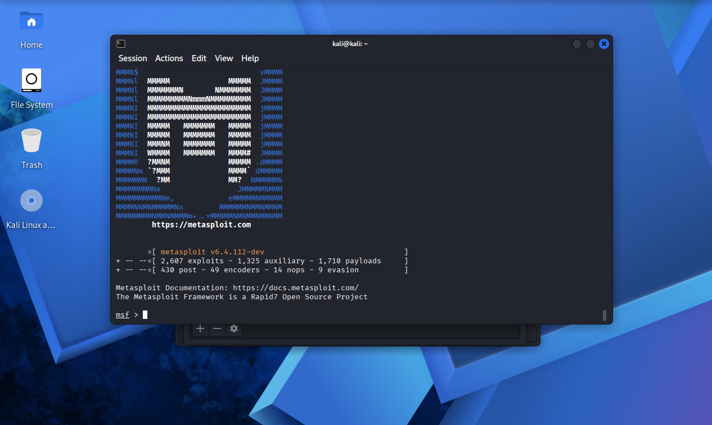

Metasploit это один из самых мощных инструментов для тестирования на проникновение. Он содержит тысячи модулей: эксплойты, сканеры, вспомогательные утилиты. Мы начнём с разведки через протокол SMB - именно через него чаще всего происходят атаки в доменных средах.

---

### Шаг 6. Определение версии SMB

Первый модуль — `scanner/smb/smb_version`. Он позволяет определить версию протокола SMB и операционную систему на целевой машине без какого-либо вмешательства в её работу. Для атакующего это чистая разведка - никаких следов, как он думает.

```bash
use scanner/smb/smb_version
set RHOSTS 10.10.70.134
run
```

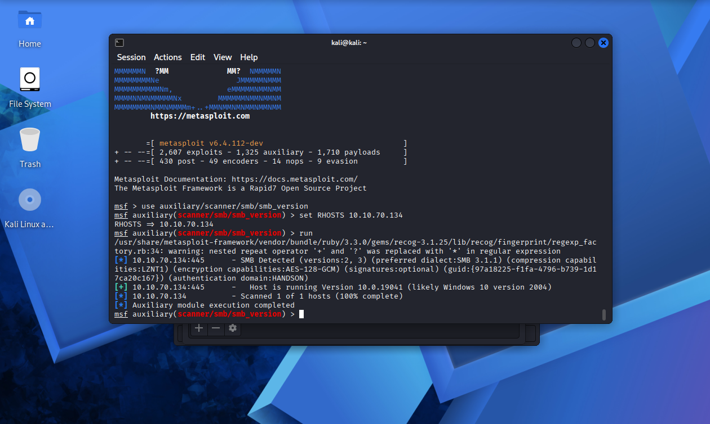

Результат говорит нам, что цель работает на **Windows 10 версии 2004**. Атакующий получил первую ценную информацию о жертве, не сделав ничего, кроме обычного сетевого запроса.

---

### Шаг 7. Проверка на уязвимость EternalBlue

Зная версию Windows, атакующий проверяет систему на наличие критической уязвимости **EternalBlue (MS17-010)** — той самой, которая использовалась в атаке WannaCry и позволяет получить полный контроль над машиной без знания пароля.

```bash
use scanner/smb/smb_ms17_010
set RHOSTS 10.10.70.134
run
```

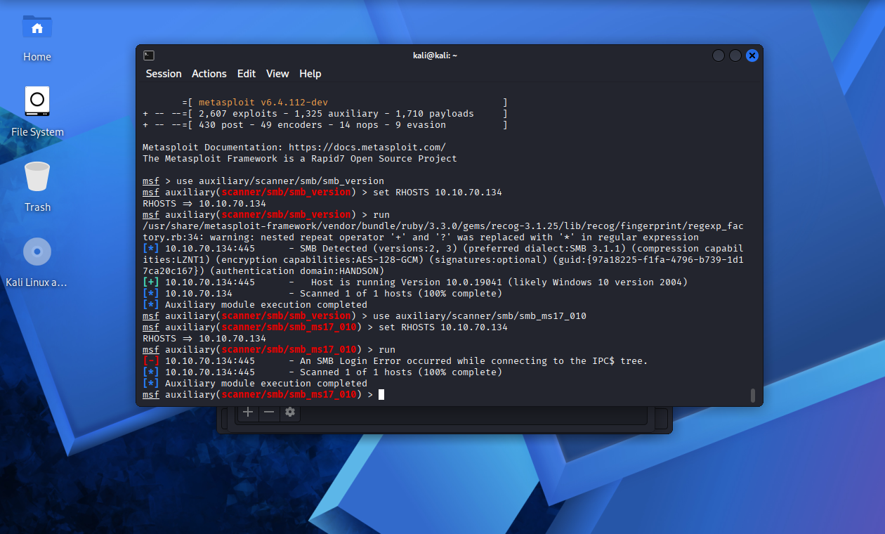

Прямая уязвимость не обнаружена - возможно, сработали политики брандмауэра. Однако даже эти попытки подключения к SMB уже оставили следы в журналах Windows. Переключаемся в Wazuh Dashboard и смотрим, что там происходит.

---

## Фаза 4: Обнаружение атаки в Wazuh

### Шаг 8. Анализ алертов в Wazuh Dashboard

Открываем **Wazuh Dashboard** и переходим в раздел **Discover**.

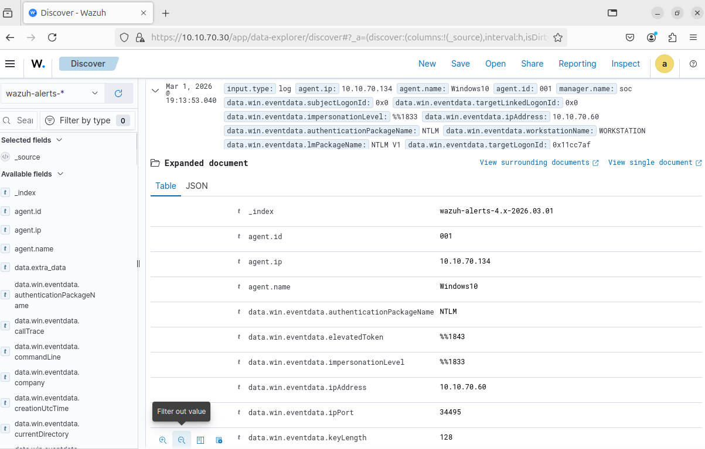

Пока атакующий проводил разведку через SMB, агент Wazuh на машине `target-PC` молча фиксировал каждое подозрительное событие и отправлял их на сервер. Разберём ключевые поля алерта подробно.

**`agent.name: Windows10`** — событие зафиксировано агентом на нашей целевой машине. Мы точно знаем, какой именно хост был атакован.

**`data.win.eventdata.ipAddress: 10.10.70.60`** — это IP-адрес атакующей машины Kali Linux, с которого мы только что проводили сканирование. Атакующий себя раскрыл.

**`data.win.eventdata.authenticationPackageName: NTLM`** — попытка аутентификации происходила по протоколу NTLM. Именно так Metasploit пытался подключиться к SMB-ресурсам машины при сканировании.

**`data.win.eventdata.lmPackageName: NTLM V1`** — используется устаревшая версия NTLMv1. Это важный индикатор компрометации — легитимные современные системы крайне редко используют NTLMv1, и его появление в логах само по себе является поводом для расследования.

**`data.win.eventdata.workstationName: WORKSTATION`** — имя рабочей станции, с которой шли попытки подключения.

Тут главное: атакующий просто запустил сканирующие модули Metasploit - он ещё не получил никакого доступа к системе и, скорее всего, считал, что действует незаметно. Но Wazuh уже зафиксировал его IP-адрес, протокол аутентификации и версию NTLM. В реальном SOC аналитик получил бы этот алерт немедленно и мог бы заблокировать атакующего ещё на этапе разведки - до того, как тот причинил какой-либо вред.

---

## Итог

На этом шестая и финальная часть нашего проекта завершена.

Мы подготовили Kali Linux к атаке и провели SMB-разведку через Metasploit. Wazuh зафиксировал активность атакующего ещё на этапе разведки - до того, как тот получил какой-либо доступ к системе. В алерте мы увидели IP атакующего, используемый протокол NTLM V1 и имя рабочей станции.

Весь проект целиком показал главную идею: **SIEM без правильной настройки — это просто хранилище логов**. Но SIEM с корректно настроенными агентами, Sysmon и политиками аудита — это система, которая видит атакующего раньше, чем он успевает причинить реальный вред. Именно этому и был посвящён наш проект — от пустой виртуальной машины до работающего SOC в миниатюре.
