# Bash scripting - автоматизация аудита системы

## Введение

Создадим Bash-скрипт для аудита безопасности: сбор пользователей, сервисов, открытых портов и подозрительных файлов с цветным выводом и сохранением отчёта. Есть аргумент --help. Каждая проверка добавляется и тестируется отдельно.

---

## Теоретическая база

### Почему bash для аудита

Bash доступен в любой Linux-системе без установки зависимостей. Скрипт запускается сразу после получения доступа к машине - именно поэтому bash остаётся стандартом для быстрых аудитных инструментов даже при наличии Python или других языков.

### Ключевые механизмы скрипта

**ANSI escape codes** - управляющие последовательности для цветного вывода в терминале. Формат: `\033[КОД_ЦВЕТАm`. Сброс цвета обязателен после каждого цветного вывода - иначе весь последующий текст останется окрашенным.

| Код | Цвет | Применение в скрипте |
| --- | --- | --- |
| `\033[0;31m` | Красный | Предупреждения, подозрительные файлы |
| `\033[0;32m` | Зелёный | Обычная информация |
| `\033[0;33m` | Жёлтый | Заметки и счётчики |
| `\033[0;36m` | Голубой | Заголовки секций |
| `\033[0m` | Сброс | После каждого цветного блока |

**`exec > >(tee -a "$REPORT") 2>&1`** - перенаправляет весь вывод скрипта одновременно в терминал и в файл. Элегантнее чем дописывать `>> $REPORT` к каждой команде.

**`$(date +%Y%m%d_%H%M%S)`** - подстановка команды в имя файла. Каждый запуск скрипта создаёт уникальный отчёт с временной меткой.

---

## Фаза 1. Создание файла и базовая структура

### Шаг 1. Создание и права

```bash
touch audit.sh
chmod +x audit.sh
nano audit.sh
```

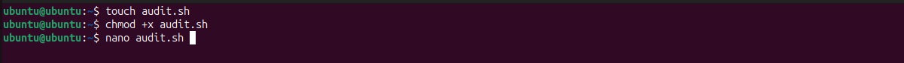

Флаг `+x` делает файл исполняемым - без него bash откажется запускать скрипт напрямую через `./audit.sh`.

### Шаг 2. Шапка скрипта - цвета, функции, отчёт

Вставляем первую часть скрипта: shebang, цветовые переменные, вспомогательные функции и настройку файла отчёта.

```bash
#!/bin/bash

RED='\033[0;31m'
GREEN='\033[0;32m'
YELLOW='\033[0;33m'
CYAN='\033[0;36m'
BOLD='\033[1m'
NC='\033[0m'

section() {
    echo ""
    echo -e "${CYAN}${BOLD}══════════════════════════════════════${NC}"
    echo -e "${CYAN}${BOLD}  $1${NC}"
    echo -e "${CYAN}${BOLD}══════════════════════════════════════${NC}"
}
warn() { echo -e "${RED}[!] $1${NC}"; }
info() { echo -e "${GREEN}[+] $1${NC}"; }
note() { echo -e "${YELLOW}[-] $1${NC}"; }

REPORT="report_$(date +%Y%m%d_%H%M%S).txt"
START_TIME=$(date '+%Y-%m-%d %H:%M:%S')
exec > >(tee -a "$REPORT") 2>&1
```

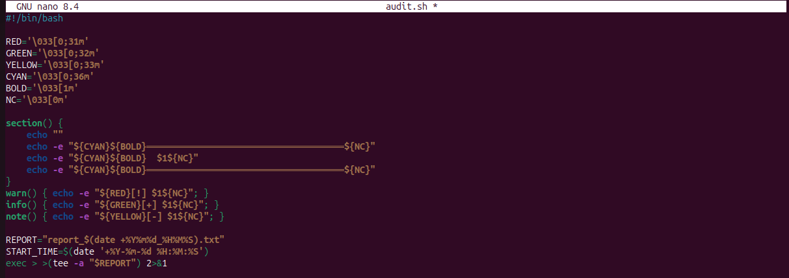

Проверяем права на созданный файл:

```bash
ls -la audit.sh
```

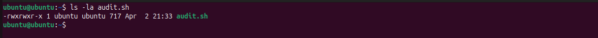

Файл имеет права `-rwxrwxr-x` - исполняемый для всех. Размер 717 байт после первой части скрипта.

---

## Фаза 2. Аргумент --help

### Шаг 3. Обработка аргумента

Добавляем блок `--help` сразу после шапки. При передаче этого аргумента скрипт выводит справку и выходит - не выполняя аудит.

```bash
if [[ "$1" == "--help" ]]; then
    echo "Usage: ./audit.sh [--help]"
    echo ""
    echo "Sections:"
    echo "  System info   - hostname, IP, uptime, kernel"
    echo "  Users         - logged in + users with shell"
    echo "  SUID/SGID     - files with special bits"
    echo "  Services      - running systemd services"
    echo "  Network       - listening ports"
    echo "  Files         - modified last 24h, world-writable"
    exit 0
fi
```

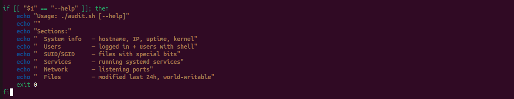

Проверяем:

```bash
./audit.sh --help
```

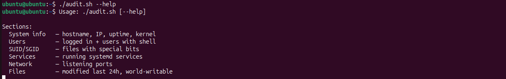

Справка выводится корректно и скрипт завершается с кодом 0.

---

## Фаза 3. Секция SYSTEM INFO

### Шаг 4. Сбор информации о системе

```bash
section "SYSTEM INFO"

info "Hostname : $(hostname)"
info "Kernel   : $(uname -r)"
info "OS       : $(cat /etc/os-release | grep PRETTY_NAME | cut -d= -f2 | tr -d '"')"
info "Uptime   : $(uptime -p)"

echo ""
note "IP Addresses:"
ip -4 addr show | grep -oP '(?<=inet\s)\d+(\.\d+){3}' | while read ip; do
    info "  $ip"
done
```

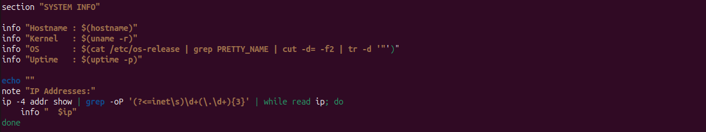

Запускаем:

```bash
sudo ./audit.sh
```

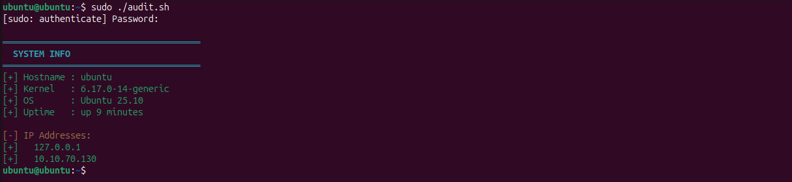

Скрипт выводит hostname `ubuntu`, ядро `6.17.0-14-generic`, ОС `Ubuntu 25.10`, uptime `up 9 minutes` и два IP-адреса: loopback `127.0.0.1` и сетевой `10.10.70.130`.

---

## Фаза 4. Секция USERS

### Шаг 5. Текущие пользователи и пользователи с shell

```bash
section "LOGGED IN USERS"

WHO_OUT=$(who)
if [[ -z "$WHO_OUT" ]]; then
    note "No users currently logged in"
else
    echo "$WHO_OUT"
fi

echo ""
note "Last 5 logins:"
last -n 5

section "USERS WITH LOGIN SHELL"

note "Users with real shell:"
echo ""
grep -v nologin /etc/passwd | grep -v '/bin/false' | \
while IFS=: read user pass uid gid desc home shell; do
    if [[ "$uid" -eq 0 ]]; then
        warn "ROOT account: $user  shell=$shell"
    else
        info "$user  uid=$uid  shell=$shell  home=$home"
    fi
done
```

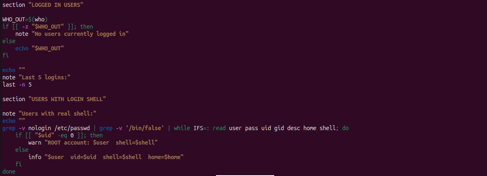

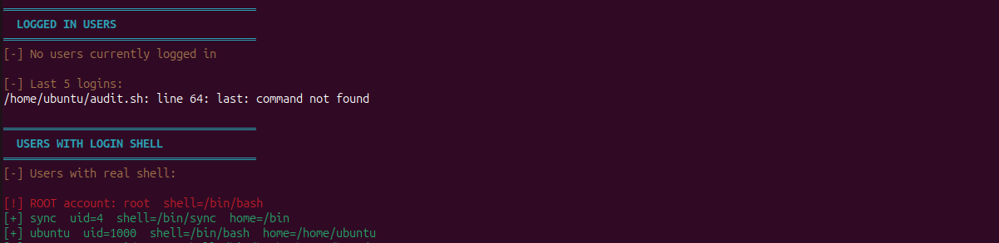

Вывод показывает: в системе никто не залогинен в данный момент. В списке пользователей с shell - root (выделен красным как предупреждение), системный `sync` и `ubuntu`.

> Команда `last` оказалась недоступна на данной системе - пакет не установлен. Это нормально для минимальных образов, скрипт продолжает работу.

---

## Фаза 5. Секция RUNNING SERVICES

### Шаг 6. Запущенные systemd-сервисы

```bash
section "RUNNING SERVICES"

systemctl list-units --type=service --state=running --no-pager \
    | grep ".service" | while read line; do
    SVC=$(echo "$line" | awk '{print $1}')
    info "$SVC"
done

echo ""
TOTAL=$(systemctl list-units --type=service --state=running \
    --no-pager | grep -c '.service')
note "Total running services: $TOTAL"
```

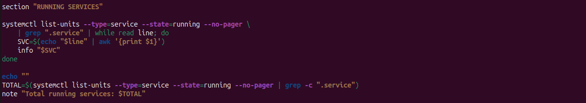


Система запустила **29 сервисов**. Среди них: `cron.service`, `NetworkManager.service`, `snapd.service`, `gdm.service`, `dbus.service`. Ничего подозрительного - стандартный набор Ubuntu с рабочим столом.

---

## Фаза 6. Секция LISTENING NETWORK PORTS

### Шаг 7. Слушающие сетевые порты

Порты ниже 1024 - привилегированные, для их открытия требуется root. Выделяем их красным.

```bash
section "LISTENING NETWORK PORTS"

ss -tlnp 2>/dev/null | grep LISTEN | while read line; do
    ADDR=$(echo "$line" | awk '{print $4}')
    PORT=$(echo "$ADDR" | rev | cut -d: -f1 | rev)
    PROC=$(echo "$line" | grep -oP '(?<=users:\(\(")[^"]*' 2>/dev/null)

    if [[ "$PORT" -lt 1024 ]] 2>/dev/null; then
        warn "Port $PORT  ($ADDR)  process: $PROC"
    else
        info "Port $PORT  ($ADDR)  process: $PROC"
    fi
done
```

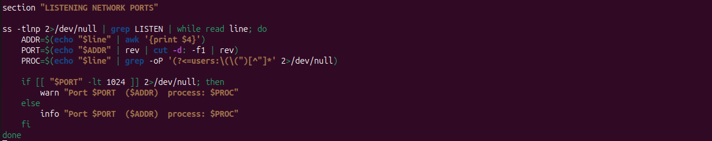

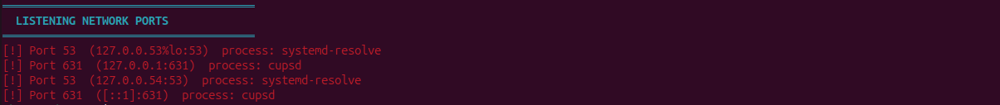

Открытых наружу портов нет - все слушают на `127.0.0.1` или `127.0.0.53`. Порт 53 — DNS через `systemd-resolved`, порт 631 — CUPS (печать). Система закрыта от внешних подключений.

---

## Фаза 7. Секция FILES

### Шаг 8. Изменённые файлы и world-writable

```bash
section "FILES MODIFIED IN LAST 24H"

warn "Scanning (excluding /proc /sys /dev /run)..."
echo ""

find / -mtime -1 -type f \
    ! -path "/proc/*" ! -path "/sys/*" \
    ! -path "/dev/*"  ! -path "/run/*" \
    2>/dev/null | sort | head -50 | while read f; do
    MTIME=$(stat -c "%y" "$f" 2>/dev/null | cut -d. -f1)
    echo "  $MTIME  $f"
done

TOTAL_MOD=$(find / -mtime -1 -type f \
    ! -path "/proc/*" ! -path "/sys/*" \
    ! -path "/dev/*"  ! -path "/run/*" \
    2>/dev/null | wc -l)
note "Total modified: $TOTAL_MOD files (showing first 50)"

section "WORLD-WRITABLE FILES"

warn "Scanning for world-writable files..."
echo ""

find / -perm -o+w -type f \
    ! -path "/tmp/*"  ! -path "/dev/*" \
    ! -path "/proc/*" ! -path "/sys/*" \
    2>/dev/null | while read f; do
    warn "world-writable: $f"
done
```

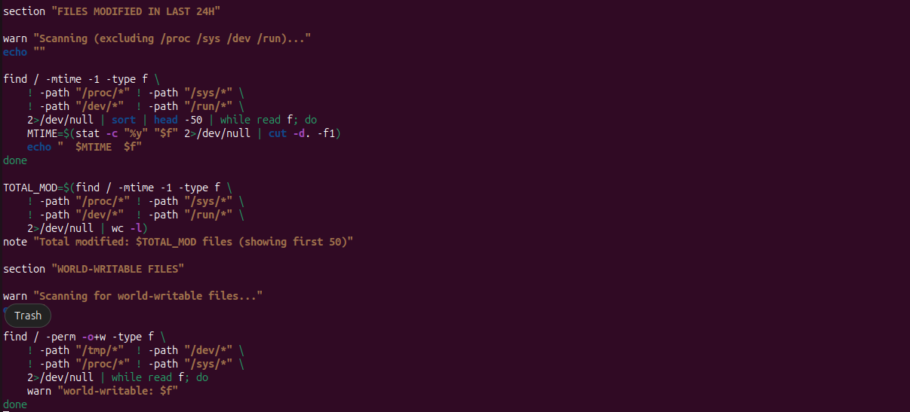

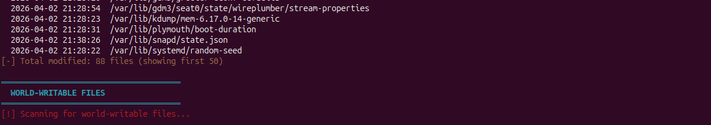

За последние 24 часа изменено **88 файлов** - это нормально для свежеподнятой системы. Среди них: `/var/lib/snapd/state.json`, `/var/lib/systemd/random-seed`, `/var/lib/plymouth/boot-duration`. Всё системное, ничего подозрительного.

---

## Фаза 8. Завершение и запуск полного скрипта

### Шаг 9. Футер отчёта

```bash
section "AUDIT COMPLETE"

END_TIME=$(date '+%Y-%m-%d %H:%M:%S')
info "Started  : $START_TIME"
info "Finished : $END_TIME"
info "Saved to : $REPORT"
```

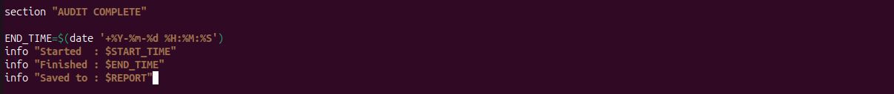

### Шаг 10. Полный запуск

```bash
sudo ./audit.sh
```


Полный аудит занял **5 секунд** (с 21:44:59 до 21:45:04). Отчёт сохранён в файл.

### Шаг 11. Просмотр отчёта

```bash
ls -la report_*.txt
cat report_20260402_214459.txt | head -40
```

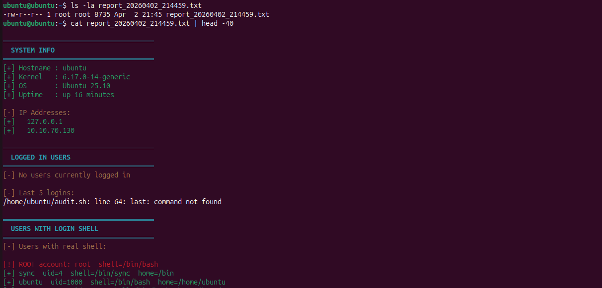

Файл отчёта весит **8735 байт**, принадлежит root (запускали через sudo). Содержимое идентично выводу в терминале - именно это обеспечивает конструкция `exec > >(tee -a "$REPORT") 2>&1`.

---

## Итоги и выводы

### Что собирает скрипт

| Секция | Команды | Что ищем |
| --- | --- | --- |
| System info | `hostname`, `uname -r`, `ip addr` | Базовый профиль системы |
| Logged in users | `who`, `last` | Активные сессии |
| Users with shell | `grep -v nologin /etc/passwd` | Аккаунты с возможностью входа |
| Running services | `systemctl list-units` | Запущенные процессы |
| Listening ports | `ss -tlnp` | Открытые сетевые сокеты |
| Modified files | `find -mtime -1` | Изменения за последние 24ч |
| World-writable | `find -perm -o+w` | Файлы доступные всем для записи |

### Что добавить для production-скрипта

**Проверка cron-задач** - вектор для persistence и эскалации привилегий:

```bash
section "CRON JOBS"
for user in $(cut -d: -f1 /etc/passwd); do
    crontab -u "$user" -l 2>/dev/null | grep -v "^#" | grep -v "^$" | while read job; do
        warn "[$user] $job"
    done
done
cat /etc/crontab 2>/dev/null
ls /etc/cron.d/ 2>/dev/null
```

**Проверка sudoers** - кто может выполнять команды от root:

```bash
section "SUDO PERMISSIONS"
cat /etc/sudoers 2>/dev/null | grep -v "^#" | grep -v "^$"
ls /etc/sudoers.d/ 2>/dev/null
```

**SSH authorized_keys** - чужие ключи в домашних директориях:

```bash
section "SSH AUTHORIZED KEYS"
find /home /root -name "authorized_keys" 2>/dev/null | while read f; do
    warn "Found: $f"
    cat "$f"
done
```

В ходе данной работы был написан bash-скрипт для автоматического аудита системы. Скрипт сохраняет отчёт с временной меткой в имени - это позволяет сравнивать состояние системы между запусками и отслеживать изменения.
