# Linux Filesystem - полная карта прав доступа

## Введение

Каждый раз, когда администратор выставляет права на файл или директорию, он принимает решение о том, кто и что может сделать в системе. Неправильная настройка этих прав - одна из самых частых причин успешных атак на Linux-системы.

В данной работе разберём Unix-права доступа: создадим изолированную структуру директорий, настроим пользователей, воспроизведём реальные сценарии атак и поймём, зачем в системе вообще существуют SUID, SGID и Sticky bit.

## Теоретическая база

### Как устроены Unix-права

Каждый файл и директория в Linux имеют три группы прав: для **владельца (owner)**, **группы (group)** и **остальных (others)**. Каждая группа содержит три бита:

| Бит | Символ | Значение для файла | Значение для директории |
| --- | --- | --- | --- |
| read | r | Чтение содержимого | Просмотр списка файлов |
| write | w | Изменение файла | Создание и удаление файлов внутри |
| execute | x | Запуск файла | Вход в директорию (cd) |

Права записываются в восьмеричной системе: `r=4`, `w=2`, `x=1`. Три цифры — для owner, group, others.

| Права | Числа | Owner | Group | Others | Типичное применение |
| --- | --- | --- | --- | --- | --- |
| rwxrwxrwx | 777 | всё | всё | всё | Никогда — это ошибка |
| rwxr-xr-x | 755 | всё | чтение + запуск | чтение + запуск | Бинарники, публичные директории |
| rwx------ | 700 | всё | ничего | ничего | Приватные директории |
| rw-r----- | 640 | чтение + запись | только чтение | ничего | Конфиги с секретами |

### Специальные биты

Помимо rwx, существуют три специальных бита, которые меняют поведение файловой системы:

**SUID (Set User ID, бит 4000)** - файл запускается с правами своего **владельца**, а не того, кто его запустил. Именно поэтому обычный пользователь может изменить свой пароль через `/usr/bin/passwd`, хотя `/etc/shadow` принадлежит root.

**SGID (Set Group ID, бит 2000)** - аналогично, но для группы. На директориях: все новые файлы внутри наследуют группу директории, а не создавшего их пользователя. Удобно для командной работы.

**Sticky bit (бит 1000)** - на директории: пользователь может удалить только **свои** файлы, даже если у него есть права на запись в саму директорию. Классический пример - `/tmp`.

В символьном виде специальные биты отображаются так:
- SUID: `s` на месте `x` у owner (`-rwsr-xr-x`)
- SGID: `s` на месте `x` у group (`-rwxr-sr-x`)
- Sticky: `t` на месте `x` у others (`drwxrwxrwt`)

---

## Фаза 1. Подготовка среды

### Шаг 1. Создание структуры директорий

Создаём дерево директорий в `/lab`. Флаг `-p` создаёт все промежуточные директории в одной команде - если `/lab` уже существует, ошибки не будет.

```bash
sudo mkdir -p /lab/public /lab/private /lab/shared
ls -la /lab/
```

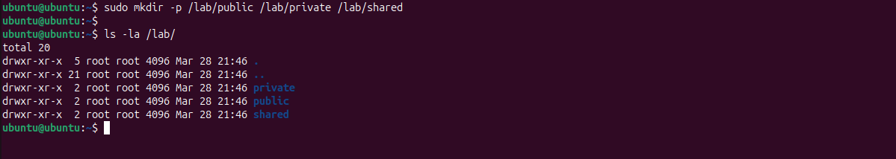

По умолчанию `mkdir` выставляет права `755` - владелец имеет полный доступ, остальные могут только читать и заходить внутрь.

### Шаг 2. Настройка прав доступа

Выставляем разные права на каждую директорию и создаём отдельную секретную директорию с жёсткими ограничениями:

```bash
sudo chmod 777 /lab/public
sudo chmod 755 /lab/private
sudo mkdir /lab/secret
sudo chmod 700 /lab/secret
```

Создаём тестовые файлы в каждой директории от имени root:

```bash
sudo bash -c 'echo "public data"  > /lab/public/file.txt'
sudo bash -c 'echo "private data" > /lab/private/file.txt'
sudo bash -c 'echo "secret data"  > /lab/secret/file.txt'

ls -la /lab/
```

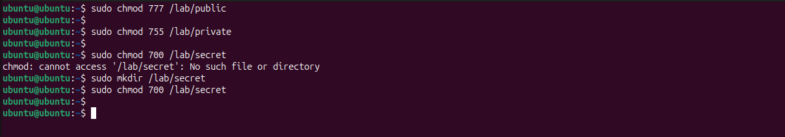

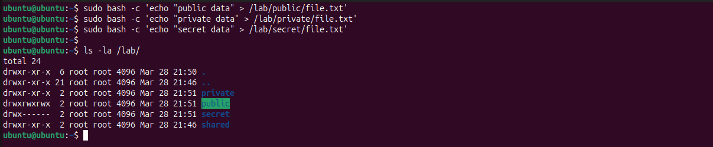

Обратите внимание на колонку прав в выводе `ls -la`: `drwxrwxrwx` для public, `drwxr-xr-x` для private и `drwx------` для secret. Директория secret полностью закрыта для всех кроме root.

---

## Фаза 2. Пользователи и разграничение доступа

### Шаг 3. Создание тестовых пользователей

Создаём двух пользователей с домашними директориями и оболочкой bash. Флаг `-m` создаёт `/home/user1`, флаг `-s` задаёт оболочку.

```bash
sudo useradd -m -s /bin/bash user1
sudo useradd -m -s /bin/bash user2
sudo passwd user1   # задай пароль: user1pass
sudo passwd user2   # задай пароль: user2pass

id user1
id user2
```

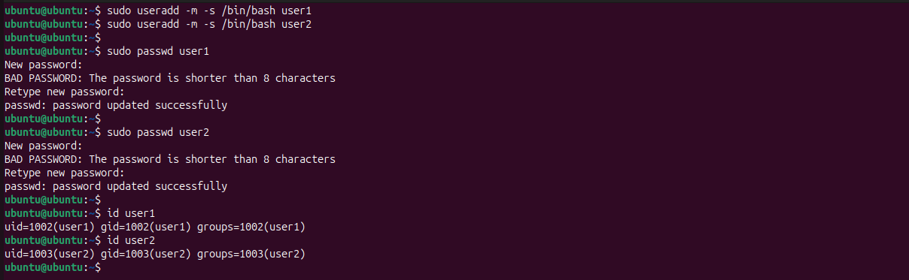

Команда `id` показывает UID и GID каждого пользователя. Оба принадлежат только своим группам - они не входят в группу root и не имеют sudo-прав.

### Шаг 4. Проверка доступа от user1

Переключаемся на user1 и проверяем, что он может, а что нет:

```bash
su - user1

ls /lab/public    # доступно - права 777
ls /lab/private   # доступно - права 755, x для others есть
ls /lab/secret    # Permission denied - права 700, только root

cat /lab/secret/file.txt  # тоже запрещено

id
exit
```

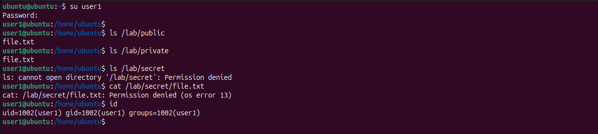

Ключевой момент: директория `/lab/private` с правами `755` **видна** обычному пользователю. Многие думают, что "private" значит закрыто — нет. Закрытое — это `700`.

### Шаг 5. Проверка доступа от user2

```bash
su - user2

ls /lab/secret    # Permission denied - аналогично
ls /lab/public    # видит файлы
exit
```

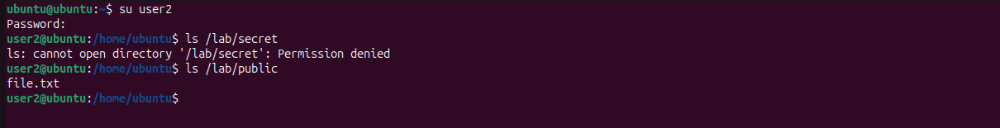

Оба пользователя получают одинаковый результат - `/lab/secret` недоступен ни одному из них. Права `700` означают: **только владелец (root) имеет доступ**.

---

## Фаза 3. Sticky bit - защита от удаления чужих файлов

### Шаг 6. Применение Sticky bit к /lab/shared

Sticky bit добавляется к правам директории как четвёртая цифра `1` в начале:

```bash
sudo chmod 1777 /lab/shared
ls -la /lab/
```

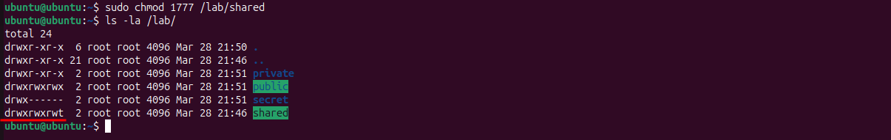

В выводе `ls` видна буква `t` в конце прав: `drwxrwxrwt`. Без sticky bit это была бы `drwxrwxrwx` - и любой пользователь мог бы удалить чужие файлы.

### Шаг 7. user2 создаёт файл в shared

```bash
su - user2

touch /lab/shared/user2_important.txt
echo "User2 data" > /lab/shared/user2_important.txt
ls -la /lab/shared/
exit
```

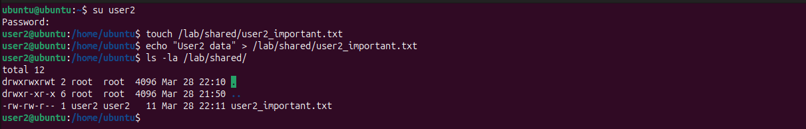

Файл создан. Владелец - user2, группа - user2. Права `664` - user2 может читать и писать, остальные только читают.

### Шаг 8. user1 пытается удалить файл user2

Без sticky bit эта операция прошла бы успешно - у user1 есть права на запись в директорию (rwxrwxrwt → w для others). Sticky bit добавляет дополнительную проверку:

```bash
su - user1

rm /lab/shared/user2_important.txt
# rm: remove write-protected regular file ...? y
# rm: cannot remove ...: Operation not permitted

# Но свои файлы — можно:
touch /lab/shared/user1_file.txt
rm /lab/shared/user1_file.txt  # работает
exit
```

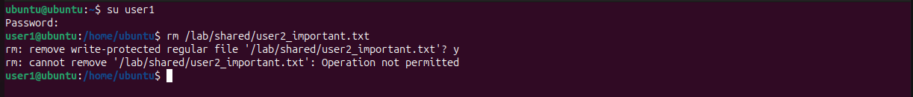

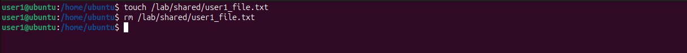

Именно так работает `/tmp` в любой Linux-системе: все могут писать, но никто не может удалить чужие временные файлы.

---

## Фаза 4. Поиск SUID и SGID файлов в системе

### Шаг 9. Поиск всех SUID файлов

`find` с флагом `-perm -4000` находит файлы, у которых установлен бит 4000 (SUID). Перенаправление `2>/dev/null` скрывает ошибки "Permission denied" при сканировании директорий без доступа.

```bash
find / -perm -4000 2>/dev/null
```

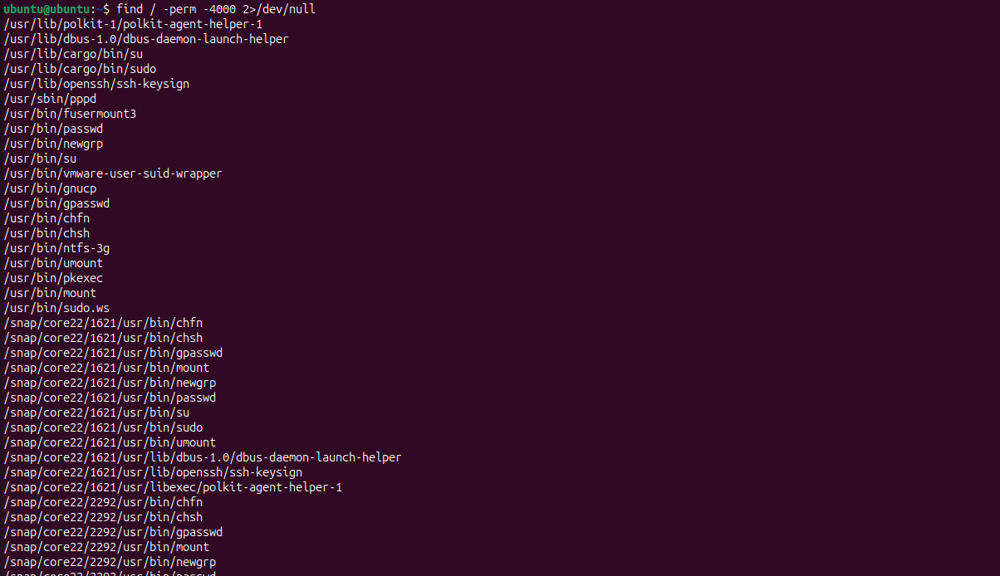

В выводе видны ключевые системные утилиты: `/usr/bin/passwd`, `/usr/bin/su`, `/usr/bin/sudo`, `/usr/bin/mount`. Все они запускаются с правами root именно потому, что их задача - выполнять привилегированные операции от имени обычного пользователя в контролируемом режиме.

### Шаг 10. Поиск всех SGID файлов

```bash
find / -perm -2000 2>/dev/null
```

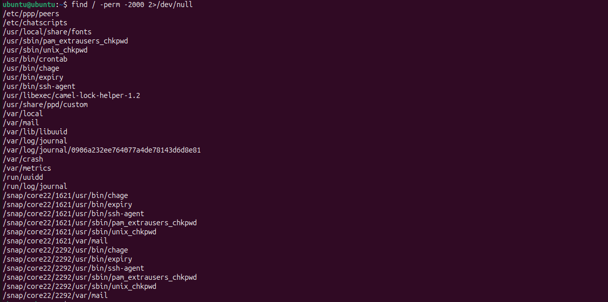

SGID-файлы включают `/usr/bin/crontab` и утилиты проверки паролей вроде `unix_chkpwd`. Последняя имеет SGID группы `shadow` — именно так она получает доступ к `/etc/shadow` для проверки паролей, не требуя полных прав root.

### Шаг 11. Оба бита - расширенный вывод

Флаг `/6000` означает "бит 4000 ИЛИ бит 2000". Передаём результат в `xargs ls -la` для подробного отображения прав каждого файла:

```bash
find / -perm /6000 -type f 2>/dev/null | xargs ls -la 2>/dev/null
```

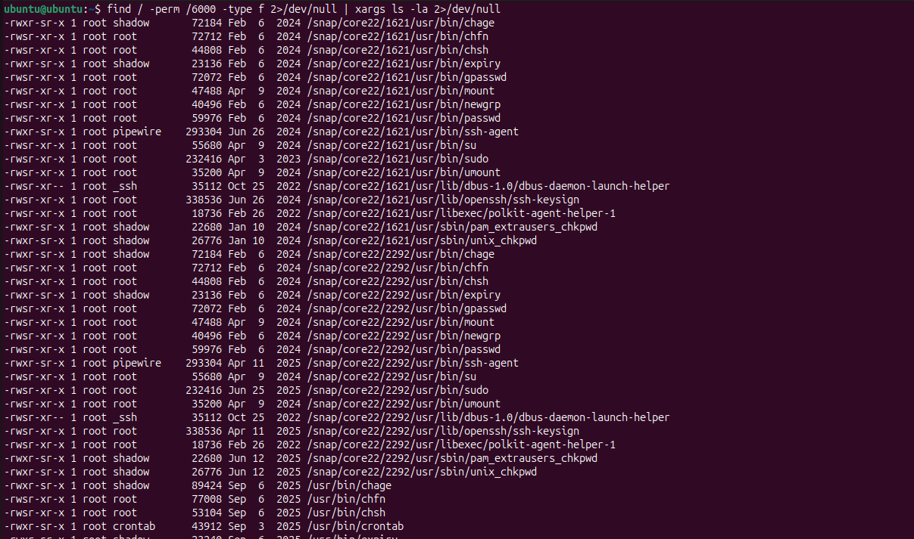

Обратите внимание: большинство найденных файлов находится в snap-окружении (`/snap/core22/...`). Snap-пакеты содержат свои копии стандартных утилит — это нормально, но при пентесте стоит проверить каждый нестандартный путь.

---

## Фаза 5. Анализ /usr/bin/passwd - почему SUID необходим

### Шаг 12. Права на passwd и shadow

```bash
ls -la /usr/bin/passwd
ls -la /etc/shadow
```

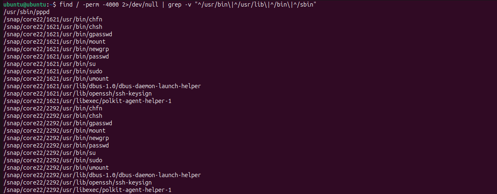

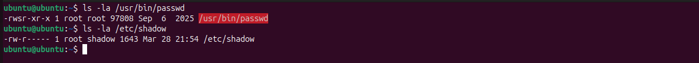

`/etc/shadow` хранит хэши паролей всех пользователей. Права на него - `640` с владельцем root и группой shadow. Обычный пользователь не входит в эту группу и не может читать файл напрямую.

### Шаг 13. user1 не может читать shadow напрямую

```bash
su - user1
cat /etc/shadow  # Permission denied
```


Прямой доступ к `/etc/shadow` заблокирован. Но пользователь должен иметь возможность **сменить свой** пароль.

### Шаг 14. Смена пароля через passwd - это работает

```bash
su - user1
passwd
# Current password: ...
# New password: ...
# passwd: password updated successfully
```

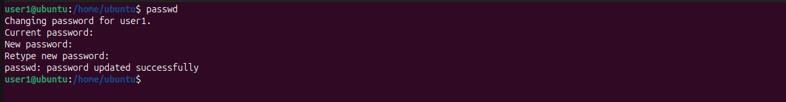

Это и есть смысл SUID. `passwd` запускается с правами root, записывает **только строку текущего пользователя** в `/etc/shadow`, и завершается. Контролируемый доступ к привилегированному ресурсу.

### Шаг 15. Трассировка системных вызовов через strace

Посмотрим, что реально происходит внутри `passwd` при вызове:

```bash
sudo strace -e trace=open,openat passwd 2>&1 | grep shadow
```

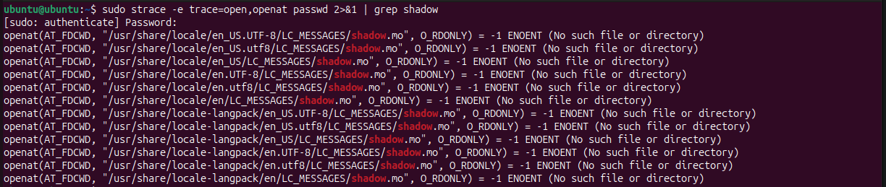

`strace` перехватывает системные вызовы `open` и `openat` - именно через них программы открывают файлы. Если в выводе появляется `/etc/shadow`, это подтверждает: `passwd` действительно обращается к защищённому файлу, действуя с правами root через механизм SUID.

---

## Фаза 6. Очистка среды

### Шаг 16. Удаление пользователей и директорий

```bash
sudo userdel -r user1
sudo userdel -r user2
sudo rm -rf /lab

# Проверяем
id user1 2>&1      # no such user
ls /lab 2>&1       # No such file or directory
```

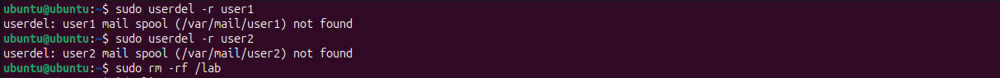

Флаг `-r` у `userdel` удаляет домашнюю директорию пользователя вместе с ним. Предупреждение о mail spool - нормально, его просто не существовало.

---

## Итоги и выводы

### Карта специальных битов

| Бит | Запись | На файле | На директории | Риск при злоупотреблении |
| --- | --- | --- | --- | --- |
| SUID | `chmod u+s` / `4xxx` | Запуск от имени владельца | Не используется | Эскалация привилегий до root |
| SGID | `chmod g+s` / `2xxx` | Запуск от имени группы | Файлы наследуют группу | Доступ к данным группы |
| Sticky | `chmod +t` / `1xxx` | Не используется | Удаление только своих файлов | Без него — удаление чужих файлов |

### Типичные ошибки и их последствия

| Ошибка | Пример | Последствие |
| --- | --- | --- |
| chmod 777 на директорию с данными | `/var/www/uploads` с правами 777 | Любой пользователь пишет и удаляет файлы |
| SUID на интерпретатор | `chmod u+s /bin/bash` | Любой получает root-shell |
| Отсутствие sticky на /tmp | `/tmp` без бита 1 | Пользователи удаляют временные файлы друг друга |
| Readable /etc/shadow | `chmod 644 /etc/shadow` | Офлайн-взлом хэшей через hashcat |
| SGID на world-writable директорию | `/lab/shared` без sticky | Файлы группы доступны всем |

### Что проверять при аудите системы

```bash
# Найти нестандартные SUID-файлы (вне стандартных путей)
find / -perm -4000 2>/dev/null | grep -v "^/usr/bin\|^/usr/lib\|^/bin\|^/sbin\|^/snap"

# Найти world-writable директории
find / -type d -perm -0002 2>/dev/null | grep -v proc

# Найти файлы без владельца (признак удалённого пользователя)
find / -nouser -o -nogroup 2>/dev/null
```

В ходе данной работы была построена полная практическая карта Unix-прав доступа: от базового `chmod` до специальных битов SUID, SGID и Sticky.
